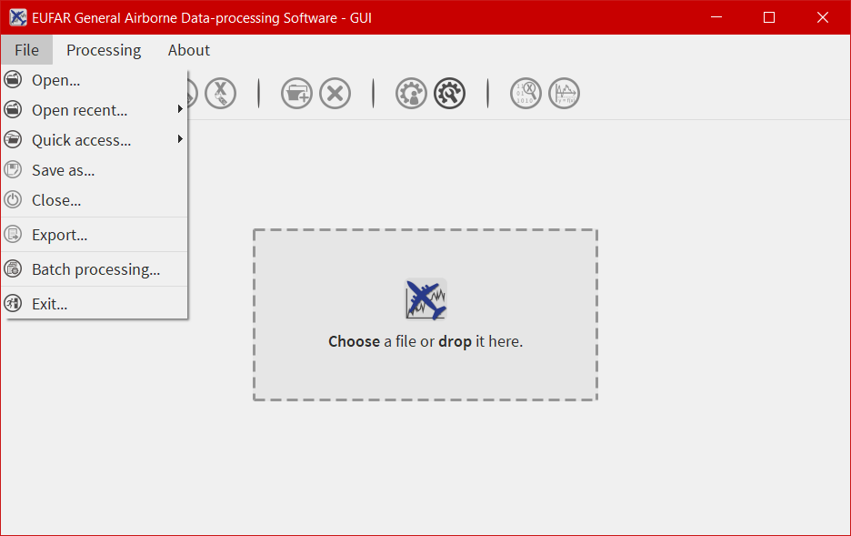
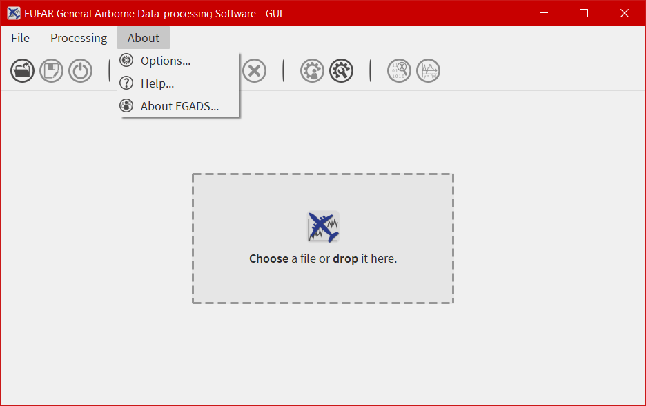
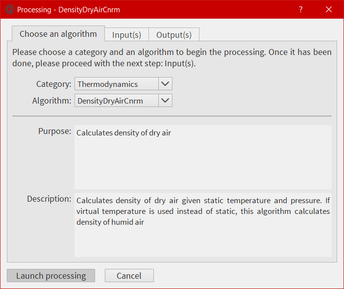
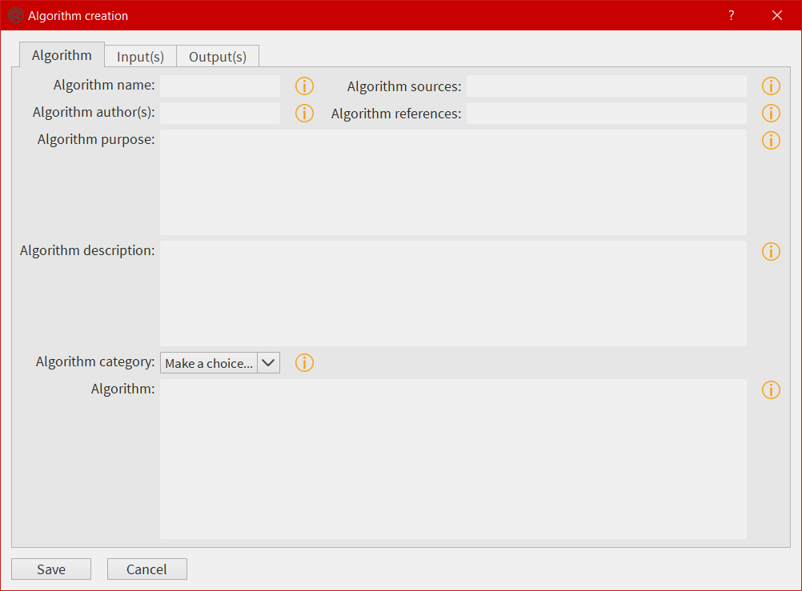
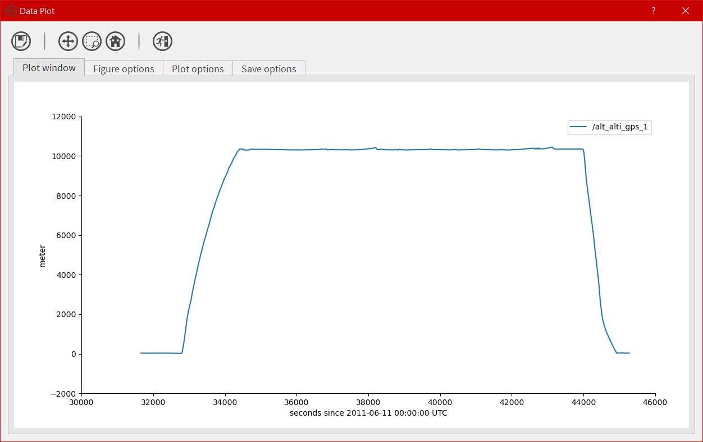
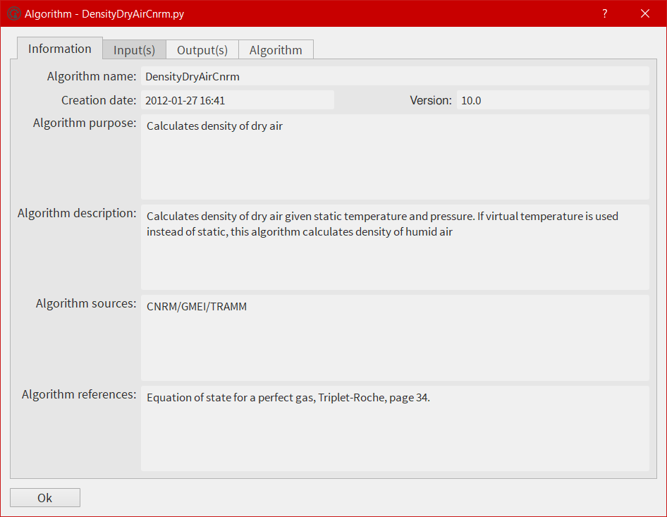
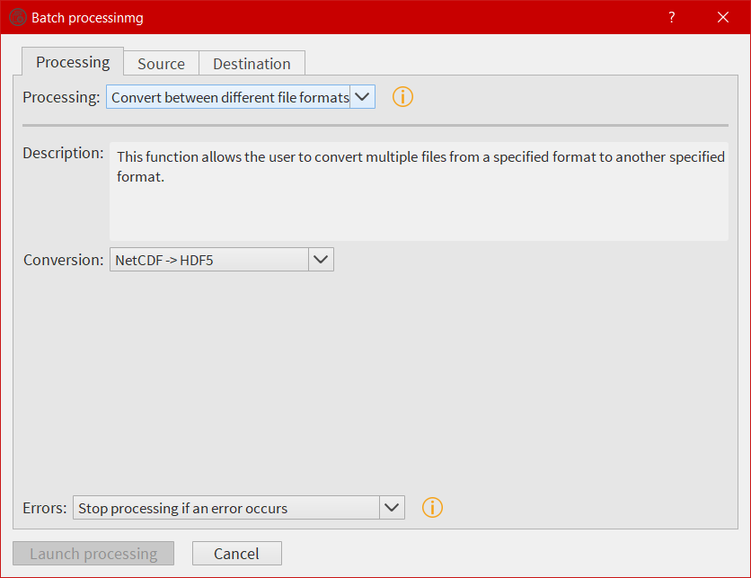
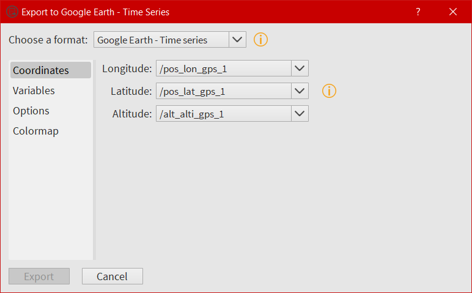
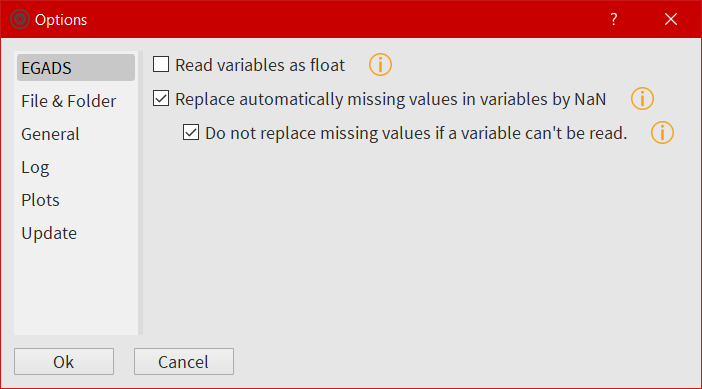

===========
Description
===========

*********************
Important information
*********************

In the following tutorial, all pictures have been made on a Windows 10 system. On the contrary, all commands, paths and files are from a Linux Mageia 6 system.

*******************
Exploring EGADS GUI
*******************

The simplest way to start working with EGADS GUI is to run it from the terminal if using the Python package::

    $ cd egads_gui/
    $ python egads_gui.py

Or by double clicking on the executable if using the stand-alone package (egads_gui.exe for Windows and egads_gui for Linux).

The EGADS GUI is composed of different windows, designed to display information to the user and accept interactions, and functions linking different parts of the GUI with EGADS. At the end of this section, information are also given about the option window, used to control EGADS and the GUI options.

-----------------------
Current GUI limitations
-----------------------

Actually, the GUI has few limitations based on the development time and the number of person working on this project. First the file formats handled by the GUI. Even if EGADS can handle text files (raw, ASCII and csv), the GUI can handle only NetCDF and NASA Ames file format (FFI 1001) at this time. 

-----------------------
Buttons and information
-----------------------

In the different windows of the Graphical User Interface, information buttons, composed of an orange information icon, have been placed to display information and/or help about different sections of a window. A left click on those buttons will display a popup window with text to explain the purpose of the area currently used.

---------------
The main window
---------------

The main window of the GUI is what the user will see first once he has launched the software.

.. image:: images/egads_gui_screencaptures/EGADS_GUI_000.png
   :width: 936px
   :height: 589px
   :scale: 45 %
   :align: center

The main window is composed of four parts, from top to bottom:

* the first one is a menu bar with three menus - ``File``, ``Processing`` and ``About`` - allowing the user to open/save a file, launch a processing on more than one file, quit the software, display the different algorithms imbedded in EGADS, and display information about the software.
* the second one is a bar containing 11 icons and giving access to different kind of functions and windows as the plot window or the metadata window.
* the third one is a central widget whose purpose is to welcome the interface dedicated to NetCDF, NASA Ames and text files.
* the last one is a footbar, used to display few information about the file actually loaded, like the name, the weight and the file conventions, and messages to confirm actions made by users.

------------
The menu bar
------------

The menu bar of EGADS GUI is composed of three submenus: File, Processing and About

^^^^
File
^^^^

File is a submenu of the menu bar.

From here, it is possible to ``Open``, ``Save As`` and ``Close`` a file. The ``Export`` allow the user to save data to KML/KMZ file format for Google Earth. If a user wants to launch the same processing on a certain amount of files, he has access to ``Batch processing``. And to quit the software, the job is done by clicking on ``Quit``.

^^^^^^^^^^^
Processing
^^^^^^^^^^^

Processing is a submenu of the menu bar.

.. image:: images/egads_gui_screencaptures/EGADS_GUI_003.png
   :width: 936px
   :height: 589px
   :scale: 45 %
   :align: center

Its purpose is to give information about all algorithms embedded in EGADS. Navigate into the submenus and click on an algorithm to show a window displaying information about the selected algorithm. It is not possible to modify the algorithm from that window yet.

^^^^^
About
^^^^^

About is a submenu of the menu bar.

The user will find here information about the software, options and link to the documentation.

----------------------------
The icon bar and the windows
----------------------------

11 icons are embedded in the icon bar, 6 of them give access to the GUI functions and 6 of them are directly linked to sub windows.

^^^^^^^^^^^^^^^^^^
The function icons
^^^^^^^^^^^^^^^^^^

The three first icons of the icon bar give access to few basic functions to control a file:

* |open| : To open a file
* |save_as| : To save a file with a different name
* |close| : To close a file

.. |save_as| image:: images/icons/save_as_icon.png
   :width: 130px
   :height: 130px
   :scale: 12 %
   :align: top

^^^^^^^^^^^^^^^^^^
The metadata icons
^^^^^^^^^^^^^^^^^^

The fourth and fifth icons give the possibility to display, modify, create global metadata, or metadata linked to a variable/group if a variable/group has been selected.

* |global_metadata| : This icon open the global metadata window, to display, modify, create global metadata associated to a file.
* |variable_metadata| : This icon open the variable metadata window, to display, modify, create metadata associated to a variable/group.

^^^^^^^^^^^^^^
The data icons
^^^^^^^^^^^^^^

The sixth and seventh icons:

* |create_group| :   EGADS can handle groups in NetCDF and HDF files, thus it is possible to create groups within the GUI. Obviously, it won't work with NASA Ames file format and trying to save a NASA Ames file with a group created in the GUI will lead to an error message.

* |delete| :    The purpose of this function is to delete a variable/group. If the file is saved after a deletion, obviously the deleted variable won't appear in the file anymore.

.. |delete| image:: images/icons/del_icon.png
   :width: 130px
   :height: 130px
   :scale: 12 %
   :align: top

^^^^^^^^^^^^^^^^^^^^
The processing icons
^^^^^^^^^^^^^^^^^^^^

The eighth and nineth icons:

* |algo_processing| : This icon is used to display the process window, from where the user can select an algorithm and apply it to one ore more variables.
* |algo_creation| : From here, the GUI give the possibility to the users to create their own algorithms.

.. |algo_creation| image:: images/icons/create_algo_icon.png
   :width: 130px
   :height: 130px
   :scale: 12 %
   :align: top

^^^^^^^^^^^^^^^^^
The display icons
^^^^^^^^^^^^^^^^^

The tenth and eleventh icons:

* |display| : The user can take a look in data by clicking on this icon.
* |plot| : This icon opens the plot window to plot time series and gridded data.

.. |display| image:: images/icons/data_icon.png
   :width: 130px
   :height: 130px
   :scale: 12 %
   :align: top

.. |plot| image:: images/icons/plot_icon.png
   :width: 130px
   :height: 130px
   :scale: 12 %
   :align: top

^^^^^^^^^^^^^^^^^^^^^^^^^^^^
The global attributes window
^^^^^^^^^^^^^^^^^^^^^^^^^^^^

The user has to click on the icon |global_metadata| to open the global attributes window.

.. image:: images/egads_gui_screencaptures/EGADS_GUI_009.png
   :width: 673px
   :height: 579px
   :scale: 45 %
   :align: center

All global attributes embedded in a NASA Ames, NetCDF and Hdf5 files are loaded in this window. The user has the possibility to modify, create and delete them. As EGADS GUI follows the EUFAR Standards & Protocols recommendations, few global attributes are thus mandatory and displayed above others. They can be modified, but they can't be deleted.

^^^^^^^^^^^^^^^^^^^^^^^^^^^^^^
The variable attributes window
^^^^^^^^^^^^^^^^^^^^^^^^^^^^^^

Accessible by clicking on the icon |variable_metadata|, the user has to select first a variable from the ``Variables`` tab of the main window.

.. image:: images/egads_gui_screencaptures/EGADS_GUI_010.png
   :width: 673px
   :height: 579px
   :scale: 45 %
   :align: center

All attributes associated to the selected variable, coming from a NetCDF, Hdf5 or a NASA Ames file, are loaded in this window. As for the global attributes window, the user can create/modify/delete attributes. Following the EUFAR Standards & Protocols recommendations, two attributes can't be deleted and modified: ``units`` and ``_FillValue``.

^^^^^^^^^^^^^^^^^^^^^
The processing window
^^^^^^^^^^^^^^^^^^^^^

Accessible by clicking on the icon |algo_processing|, a variable can be processed with an algorithm already embedded in EGADS or created by a user.

Here the user has the possibility to select an algorithm from the EGADS algorithm list, select one or more variables from the opened file, add factors or numbers, name the output and launch the process. Information about the algorithm is displayed in the first tab. The second tab displays information coming from the input section of each algorithm, info buttons are here to give details about each input. The third tab is dedicated to the output(s).

^^^^^^^^^^^^^^^^^^^^^^^^^^^^^
The algorithm creation window
^^^^^^^^^^^^^^^^^^^^^^^^^^^^^

One of the main goal of EGADS is to let the user creates his own algorithms. Accessible by clicking on the icon |algo_creation|, this window is an automated system to create algorithm from the user inputs.

The window is composed of three tabs. The first tab is dedicated to the metadata of the algorithm and, the most important, to the mathematic formula. The second tab is dedicated to the input(s). The user will fill the different text boxes to prepare the input variable(s). The last tab is dedicated to the output(s). As the window follows the EGADS convention, few tips have to be used here and will be explained later. Once the user click on ``Save``, an automated task will check every item in the window, in particular units, and will display a warning popup is something went wrong. The algorithm is then saved in the ``user_algorithms`` sub-folder of EGADS in $HOME directory. For help purpose, few info buttons are present.
The system doesn't test the algorithm created by the user, it is expected to work, and the user has to give his greatest attention when writing the algorithm using Python 3. If a complex algorithm needs to be written, the use of a text editor and the manual declaration of the algorithm in EGADS are strongly encouraged.

.. NOTE ::
  English and normal characters must be used to write every part of the algorithm. Special characters can't be used and it will lead to a crash if the GUI tries to save a file with special characters.

.. NOTE ::
  For more details on how to create algorithms and the purpose of each field, please take a look in the EGADS Lineage Documentation, chapter ALGORITHM DEVELOPMENT.

^^^^^^^^^^^^^^^^^^^^^^^
The data display window
^^^^^^^^^^^^^^^^^^^^^^^

Accessible by clicking on the icon |display|, the user has to select first a variable from the ``Variables`` tab of the main window.

.. image:: images/egads_gui_screencaptures/EGADS_GUI_011.png
   :width: 652px
   :height: 439px
   :scale: 45 %
   :align: center

Here the user can take a look directly in the variable.

^^^^^^^^^^^^^^^
The plot window
^^^^^^^^^^^^^^^

Accessible by clicking on the icon |plot| or by the right click menu, the user has to select a variable to display the window. The purpose of that window is to give the user the possibility to plot all kind of data and to save the corresponding figure. It is possible to plot multiple variables by selecting them in the list using ctrl + left click.

The plot window is composed of an icon bar including six icons and four different tabs:

* |save_as| : To save a figure
* |move| : To move the view in the figure
* |zoom| : To zoom on a selection
* |origin| : To reset the view
* |quit| : To quit the plot window
* The first tab is dedicated to the plot area, the software will create the figure automatically with default options.
* In the second and third tab, the software gives the possibility to the user to change few options for each curve or for the whole figure.
* The last tab is only dedicated to the options involved when a figure is saved.

.. |move| image:: images/icons/pan_icon.png
   :width: 130px
   :height: 130px
   :scale: 12 %
   :align: top

.. |origin| image:: images/icons/origin_icon.png
   :width: 130px
   :height: 130px
   :scale: 12 %
   :align: top

The design of the plot window is based on the access to as many options as possible to let the user modify the figure to his heart content, quickly and easily. Obviously, if the user wants to create complex figures, it is strongly encouraged to use EGADS and Matplotlib from a script.

^^^^^^^^^^^^^^^^^^^^^^^^^^^^^^^^
The algorithm information window
^^^^^^^^^^^^^^^^^^^^^^^^^^^^^^^^

From the Processing menu, the user has the possibility to display information about each algorithm embedded in EGADS or created by himself.

^^^^^^^^^^^^^^^^^^^^^^^^^^^
The batch processing window
^^^^^^^^^^^^^^^^^^^^^^^^^^^

For those who want to process more than one file at a time, they can use the batch processing function from the File menu.

^^^^^^^^^^^^^^^^^^^^^^^^^^^
The export window
^^^^^^^^^^^^^^^^^^^^^^^^^^^

For those who want to export their data into another external format, they can use the export function from the File menu. At this time, only KML/KMZ file format for Google Earth (data along a path, generally time series) is available. The export possibilities will expand in the future.

----------------------------------------------
The central widget, example with a NetCDF file
----------------------------------------------

Once a NetCDF or NASA Ames file has been opened in the GUI, a new interface object is displayed. It's a Tab Widget composed of three tabs.

^^^^^^^^^^^^^^^^^^^^^^^^^
The global attributes tab
^^^^^^^^^^^^^^^^^^^^^^^^^

The purpose of the first tab is to display the main global attributes of a NetCDF, Hdf5 or NASA Ames file. The tab is following the EUFAR Standards & Protocols NetCDF convention and few attributes are automatically displayed. Important information about the dataset is usually recorded in the global attributes.

.. image:: images/egads_gui_screencaptures/EGADS_GUI_005.png
   :width: 936px
   :height: 589px
   :scale: 45 %
   :align: center

The edit icon |edit icon| for each field gives the user the possibility to modify each global attribute from the tab view. Once an attribute has been modified, the file has to be saved to keep the new attribute.

.. NOTE::
  Once the user has clicked on the |edit icon|, and before confirming its modification by clicking on the |save as icon|, it is possible to cancel the modification by doing a right click on the same button. It will close the edit mode and replace the new text by the old one.

^^^^^^^^^^^^^^^^^
The variables tab
^^^^^^^^^^^^^^^^^

The second tab is dedicated to variables and there attributes.

.. image:: images/egads_gui_screencaptures/EGADS_GUI_006.png
   :width: 936px
   :height: 589px
   :scale: 45 %
   :align: center

A list of all variables included in the NetCDF/Hdf5/NASA Ames file is displayed in the left side, ordered alphabetically. If a user clicks on a variable, attributes will be displayed on the right side of the tab. As for the global attributes tab, an edit icon |edit icon| is here to let the user modify directly the variable attributes from the tab. Right clicks are also registered to cancel a modification in edit mode. Few of them are not intended to be modify, like the units or the non value, consequently a grey colour is superimposed on them to inform the user.

.. |edit icon| image:: images/icons/edit_icon.png
   :width: 130px
   :height: 130px
   :scale: 12 %
   :align: top

.. |save as icon| image:: images/icons/save_as_icon.png
   :width: 130px
   :height: 130px
   :scale: 12 %
   :align: top

-----------
The footbar
-----------

The purpose of the footbar is to display information about the file actually loaded, like the name, the size and the conventions, and messages to confirm the actions of the user, like the modification of metadata or the creation of variables. 

---------------------
EGADS and GUI options
---------------------

The options of EGADS and its GUI are controled through the option window, in the About menu.

In the Log options section, the user will find options to control the logging system: the log level and the path where to save the log file. In the EGADS options section, the user can control options usually set in EGADS. Please refer to the documentation of EGADS for more details about those options.