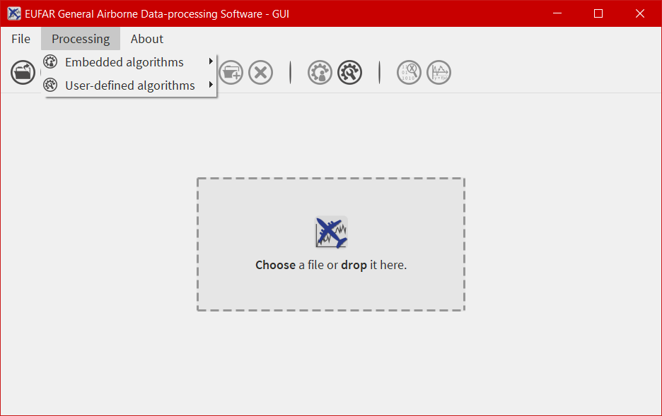
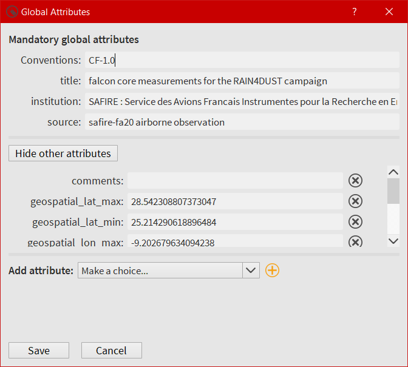
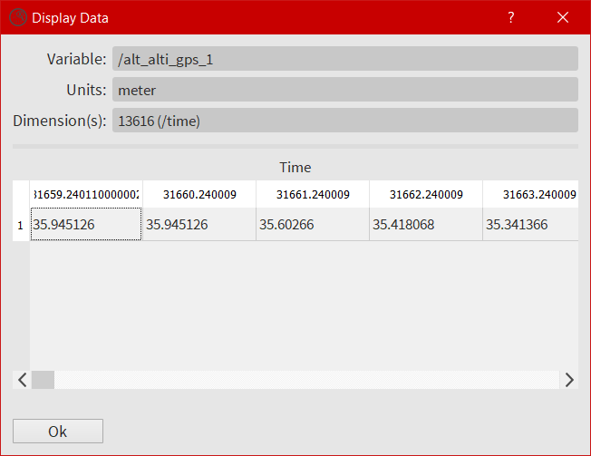

===========
Description
===========

*********************
Important information
*********************

In the following tutorial, all pictures have been made on a Windows 10 system. On the contrary, all commands, paths and files are from a Linux Mageia 6 system.

*******************
Exploring EGADS GUI
*******************

The simplest way to start working with EGADS GUI is to run it from the terminal::

    $ cd egads_gui/
    $ python egads_gui.py

The EGADS GUI is easy to use and self explaining by the presence of information button (once a button is clicked, a popup will appear with text to explain the purpose of the area actually used) and tool tips.

The EGADS GUI is composed of different windows, designed to display information to the user and accept interactions, and functions linking the different parts of the GUI with EGADS.

-----------------------
Current GUI limitations
-----------------------

Actually, the GUI has few limitations based on the development time and the number of person working on this project. First the file formats handled by the GUI. Even if EGADS can handle text files (raw, ASCII and csv), the GUI can handle only NetCDF and NASA Ames file format at this time. Second, matrix variable (that is to say variables based on multiple dimensions, or gridded data) can be loaded in the GUI, but, at this time, only time series can be handled by the plot function. Third, the NASA Ames function can only handle files with a FFI equal to 1001.

---------------
The main window
---------------

The main window of the GUI is what the user will see first once he has launched the software.

.. image:: images/egads_gui_screencaptures/EGADS_GUI_000.png
   :width: 1167px
   :height: 598px
   :scale: 45 %
   :align: center

The main window is composed of four parts, from up to down:

* the first one is a menu bar with three menus - ``File``, ``Processings`` and ``About`` - allowing the user to open/save a file, launch a processing on more than one file, quit the software, display the different algorithms imbedded in EGADS, and display information about the software.
* the second one is a bar containing 13 icons and giving access to different kind of functions and windows as the plot window or the metadata window.
* the third one is a central widget whose purpose is to welcome the interface dedicated to NetCDF, NASA Ames and text files.
* the last one is a footbar, used to display few information about the file actually loaded, like the name, the weight and the conventions.

------------
The menu bar
------------

The menu bar of EGADS GUI is composed of three submenus: File, Processings and About

^^^^
File
^^^^

File is a submenu of the menu bar.

.. image:: images/egads_gui_screencaptures/EGADS_GUI_002.png
   :width: 1167px
   :height: 598px
   :scale: 45 %
   :align: center

From here, it is possible to ``Open``, ``Save``, ``Save As`` and ``Close`` a file. If a user wants to launch the same processing on a certain amount of files, he has access to ``Bath processing``. And to quit the software, the job is done by clicking on ``Quit``.

^^^^^^^^^^^
Processing
^^^^^^^^^^^

Processing is a submenu of the menu bar.

Its purpose is to give information about all algorithms embedded in EGADS. Navigate into the submenus and click on an algorithm to show a window displaying information about the selected algorithm. It is not possible to modify the algorithm from that window.

^^^^^
About
^^^^^

About is a submenu of the menu bar.

.. image:: images/egads_gui_screencaptures/EGADS_GUI_004.png
   :width: 1167px
   :height: 598px
   :scale: 45 %
   :align: center

The user will find here information about the software and links to the EUFAR website.

----------------------------
The icon bar and the windows
----------------------------

13 icons are embedded in the icon bar, 7 of them give access to the GUI functions and 6 of them are directly linked to sub windows.

^^^^^^^^^^^^^^^^^^
The function icons
^^^^^^^^^^^^^^^^^^

The four first icons of the icon bar give access to few basic functions to control a file:

* |open| : To open a file
* |save| : To save a file which is already opened
* |save_as| : To save a file with a different name
* |close| : To close a file

.. |open| image:: images/icons/open_popup_icon.png
   :width: 130px
   :height: 130px
   :scale: 25 %
   :align: middle

.. |save_as| image:: images/icons/save_as_icon.png
   :width: 130px
   :height: 130px
   :scale: 25 %
   :align: middle

.. |close| image:: images/icons/off_icon.png
   :width: 130px
   :height: 130px
   :scale: 25 %
   :align: middle

^^^^^^^^^^^^^^
The data icons
^^^^^^^^^^^^^^

The seventh, eighth, and ninth icons are here to manipulate data:

* |create| :    With this function, the user have the possibility to create a simple variable : a time series composed of 0 or 1, or a suite of values from n_start to n_end, or a matrix with personal values. It can be useful when a small matrix with optical values is needed in the case of few optical algorithms. NOT AVAILABLE AT THIS TIME
* |migrate| :   In EGADS GUI, once a variable is processed through an algorithm, the result is a new variable displayed in the ``New variables`` tab of the central widget. In this tab, a variable can't be saved in a file, only variables in the ``Variable`` tab are saved. The user has to migrate the new variable to the ``Variables`` tab. And he can do that with this function.
* |delete| :    The purpose of this function is to delete a variable. If the file is saved after a deletion, obviously the deleted variable won't appear in the file anymore.

.. |migrate| image:: images/icons/migrate_icon.png
   :width: 130px
   :height: 130px
   :scale: 25 %
   :align: middle

.. |delete| image:: images/icons/del_icon.png
   :width: 130px
   :height: 130px
   :scale: 25 %
   :align: middle

^^^^^^^^^^^^^^^^^^^^^^^^^^^^
The global attributes window
^^^^^^^^^^^^^^^^^^^^^^^^^^^^

The user has to click on the icon |global attributes| to open the global attributes window.

.. |global attributes| image:: images/icons/glo_metadata_icon.png
   :width: 130px
   :height: 130px
   :scale: 12 %

All global attributes embedded in a NASA Ames or NetCDF files are loaded in this window. The user has the possibility to modify, create and delete them. As EGADS GUI follows the EUFAR Standards & Protocols recommendations, few global attributes are thus mandatory and displayed above others. They can be modified, but they can't be deleted.

^^^^^^^^^^^^^^^^^^^^^^^^^^^^^^
The variable attributes window
^^^^^^^^^^^^^^^^^^^^^^^^^^^^^^

Accessible by clicking on the icon |variable attributes|, the user has to select first a variable from the ``Variables`` tab of the main window.

.. |variable attributes| image:: images/icons/var_metadata_icon.png
   :width: 130px
   :height: 130px
   :scale: 12 %

.. image:: images/egads_gui_screencaptures/EGADS_GUI_010.png
   :width: 717px
   :height: 454px
   :scale: 45 %
   :align: center

All attributes linked to the selected variable, coming from a NetCDF or a NASA Ames file, are loaded in this window. As for the global attributes window, the user can create/modify/delete attributes. Following the EUFAR Standards & Protocols recommendations, two attributes can't be deleted and modified: ``units`` and ``_FillValue``.

^^^^^^^^^^^^^^^^^^^^^
The processing window
^^^^^^^^^^^^^^^^^^^^^

Accessible by clicking on the icon |launch process|, a variable can be processed with an algorithm already embedded in EGADS or created by a user.

.. |launch process| image:: images/icons/new_algo_icon.png
   :width: 130px
   :height: 130px
   :scale: 12 %

.. image:: images/egads_gui_screencaptures/EGADS_GUI_012.png
   :width: 717px
   :height: 619px
   :scale: 45 %
   :align: center

Here the user has the possibility to select an algorithm from the EGADS algorithm list, select one or more variables from the opened file, add factors or numbers if necessary by the algorithm, name the output and launch the process. Information about the algorithm is displayed in the first tab. The second tab displays information coming from the input section of each algorithm, info buttons are here to give details about each input. The third tab is dedicated to the output(s).

^^^^^^^^^^^^^^^^^^^^^^^^^^^^^
The algorithm creation window
^^^^^^^^^^^^^^^^^^^^^^^^^^^^^

One of the main goal of EGADS is to let the user creates his own algorithms. Accessible by clicking on the icon |create algorithm|, this window is an automated system to create algorithm from the user inputs.

.. image:: images/egads_gui_screencaptures/EGADS_GUI_017.png
   :width: 1017px
   :height: 754px
   :scale: 45 %
   :align: center

The window is composed of three tabs. The first tab is dedicated to the input(s). The user will fill the different text boxes to prepare the input variable(s). The second tab is dedicated to the output(s). As the window follows the EGADS convention, few tips have to be used here and will be explained later. The last tab is dedicated to the metadata of the algorithm and, the most important, to the mathematic formula. Once the user click on ``Save``, an automated task will check every item in the window, in particular units, and will display a warning popup is something went wrong. The algorithm is then saved in the ``user`` sub-folder of the EGADS/Algorithms folder. For help purpose, few info buttons are present.
The system doesn't test the algorithm created by the user, it is expected to work, and the user has to give his greatest attention when writing the algorithm. If a complex algorithm needs to be written, the use of a text editor and the manual declaration of the algorithm in EGADS are strongly encouraged.

^^^^^^^^^^^^^^^^^^^^^^^
The data display window
^^^^^^^^^^^^^^^^^^^^^^^

Accessible by clicking on the icon |display data|, the user has to select first a variable from the ``Variables`` tab of the main window.

.. |display data| image:: images/icons/data_icon.png
   :width: 130px
   :height: 130px
   :scale: 12 %

Here the user can take a look directly in the variable.

^^^^^^^^^^^^^^^
The plot window
^^^^^^^^^^^^^^^

Accessible by clicking on the icon |plot data|, the user have to select the ``Variables`` tab to enable the window. The purpose of that window is to give the user the possibility to plot all kind of data and to save the corresponding figure.

.. |plot data| image:: images/icons/plot_icon.png
   :width: 130px
   :height: 130px
   :scale: 12 %

.. image:: images/egads_gui_screencaptures/EGADS_GUI_018.png
   :width: 1122px
   :height: 713px
   :scale: 45 %
   :align: center

The plot window is composed of an icon bar including six icons and four different tabs:

* |save_as| : To save a figure
* |move| : To move the view in the figure
* |zoom| : To zoom on a selection
* |origin| : To reset the view
* |reset| : To reset the plot window
* |quit| : To quit the plot window
* The first tab is dedicated to the selection of the type of graph. Once the user has selected a simple plot or a multiple plot, and the variables he wants to display, the software will create the figure automatically with default options.
* In the second and third tab, empty before creating the figure, the software gives the possibility to the user to change few options for each curve or for the whole figure.
* The last tab is only dedicated to the options involved when a figure is saved.

.. |save_as| image:: images/icons/save_as_icon.png
   :width: 130px
   :height: 130px
   :scale: 25 %
   :align: middle

.. |zoom| image:: images/icons/zoom_icon.png
   :width: 130px
   :height: 130px
   :scale: 25 %
   :align: middle

.. |reset| image:: images/icons/del_icon.png
   :width: 130px
   :height: 130px
   :scale: 25 %
   :align: middle

.. |quit| image:: images/icons/exit_icon.png
   :width: 130px
   :height: 130px
   :scale: 25 %
   :align: middle

The design of the plot window is based on the access to as many options as possible to let the user modify the figure to his heart content, quickly and easily. Obviously, if the user wants to create complex figures, it is strongly encouraged to use EGADS and Matplotlib from a usual python script.

----------------------------------------------
The central widget, example with a NetCDF file
----------------------------------------------

Once a NetCDF or NASA Ames file has been opened in the GUI, a new interface object is displayed. It's a Tab Widget composed of three tabs.

^^^^^^^^^^^^^^^^^^^^^^^^^
The global attributes tab
^^^^^^^^^^^^^^^^^^^^^^^^^

The purpose of the first tab is to display the main global attributes of a NetCDF or NASA Ames. Concerning NetCDF, the tab is following the EUFAR Standards & Protocols NetCDF convention and few attributes are automatically displayed. Important information about the dataset is usually recorded in the global attributes.

.. image:: images/egads_gui_screencaptures/EGADS_GUI_005.png
   :width: 1167px
   :height: 601px
   :scale: 45 %
   :align: center

The edit icon |edit icon| for each field gives the user the possibility to modify each global attribute from the tab view. Once an attribute has been modified, the file has to be saved to keep the new attribute.
Finally an object in the lower part of the central widget is here to give information about the compatibility of the file, if it is a NetCDF one, with the official EUFAR Standards and Protocols NetCDF convention.

.. NOTE::
  Once the user has clicked on the |edit icon|, and before confirming its modification by clicking on the |save as icon|, it is possible to cancel the modification by doing a right click on the same button. It will close the edit mode and replace the new text by the old one.

^^^^^^^^^^^^^^^^^
The variables tab
^^^^^^^^^^^^^^^^^

The second tab is dedicated to variables and there attributes.

.. image:: images/egads_gui_screencaptures/EGADS_GUI_006.png
   :width: 1167px
   :height: 601px
   :scale: 45 %
   :align: center

A list of all variables included in the NetCDF/NASA Ames file is displayed in the left side, ordered alphabetically. If a user clicks on a variable, attributes will be displayed on the right side of the tab. As for the global attributes tab, an edit icon |edit icon| is here to let the user modify directly the variable attributes from the tab. Right clicks are also registered to cancel a modification in edit mode. Few of them are not intended to be modify, like the units or the non value, consequently a grey colour is superimposed on them to inform the user.

.. |save as icon| image:: images/icons/save_as_icon.png
   :width: 130px
   :height: 130px
   :scale: 12 %

^^^^^^^^^^^^^^^^^^^^^
The new variables tab
^^^^^^^^^^^^^^^^^^^^^

The purpose of the third tab, not visible by default, is to welcome newly-created variables.

This tab behaves completely as the ``Variables`` tab.

-----------
The footbar
-----------

The purpose of the footbar is to display few information about the file actually loaded, like the name, the size and the conventions.
