========
Tutorial
========

*********************
Important information
*********************

All tutorials proposed here are produced using a NetCDF file as a reference. Apart from the fact that metadata are different, there is almost no difference concerning the interface if using a NASA Ames file.
Once the GUI is ready to handle raw, csv and text files, the corresponding tutorials will be added here if certain differences exist compared to NetCDF handling.

*******************
How to open a file?
*******************

* To open a file, a NetCDF file for example, the easiest way is to drag and drop the file in the dedicated area of the GUI. Or there is still the possibility to use the open |open| button, from the tool bar or from the ``File`` menu. 

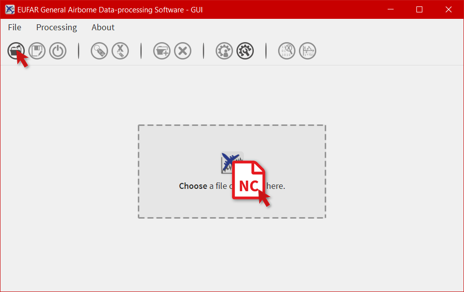

.. |open| image:: images/icons/open_popup_icon.png
   :width: 130px
   :height: 130px
   :scale: 12 %
   :align: middle

* Then apply the filter ``NetCDF Files (*.nc)``, select the NetCDF file you want to open in the list, and click on ``Open``.

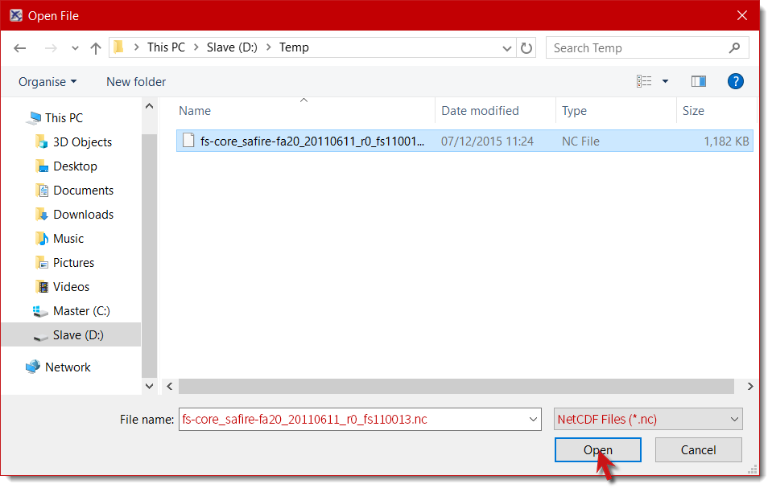

* In any way, if the file is loaded as it should, the interface specific to NASA Ames/NetCDF files should be displayed without any warning.

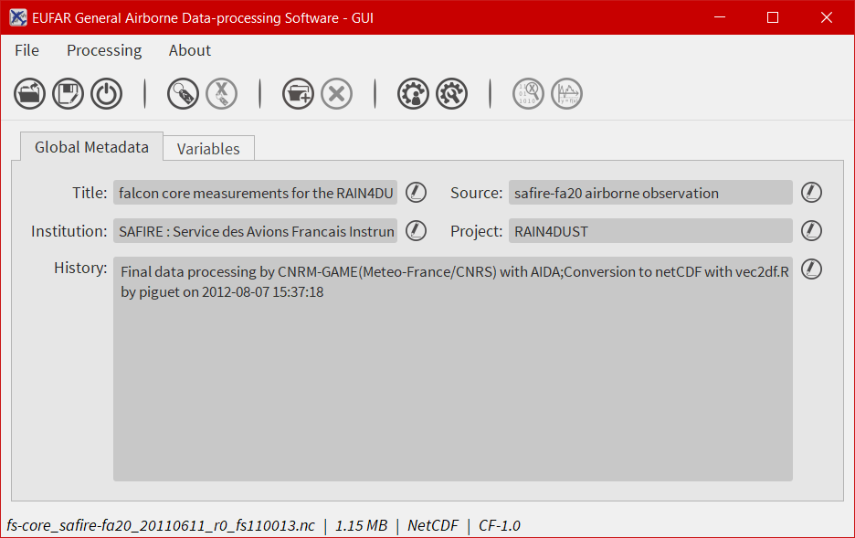

*******************
How to save a file?
*******************

* To save a file, the user has to click on |save_as|. It's the usual way to save a file with a new name, or to convert a file from a format to another format.

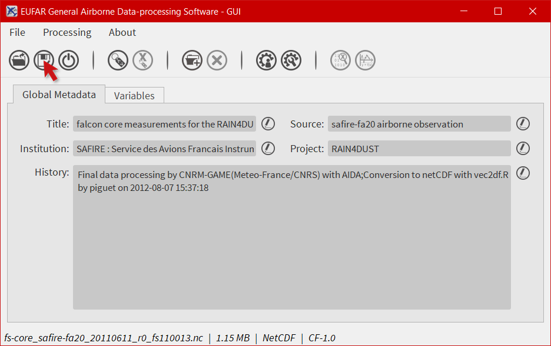

* When ``Saving As`` is selected, just enter the name of the new file and the format, then click ``Save`` to confirm the action.

********************
How to close a file?
********************

* Once a file has been opened, it is possible to close it by clicking on |close|.

.. image:: images/egads_gui_screencaptures/EGADS_GUI_close_file_1.png
   :width: 936px
   :height: 647px
   :scale: 45 %
   :align: center

.. |close| image:: images/icons/off_icon.png
   :width: 130px
   :height: 130px
   :scale: 12 %

* As a consequence, the graphical interface should be cleaned.

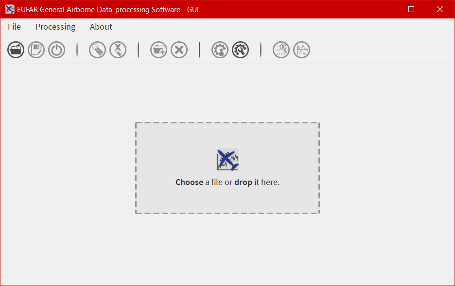

*****************************************************
How to modify the global attributes of a NetCDF file?
*****************************************************

EGADS GUI proposes two ways to modify a global attribute: from the global attributes tab and from the global attributes window. The global attributes tab only shows the most important attributes, in agreement with the EUFAR Standards & Protocols NetCDF convention. The second solution is the only one if the user wants to display other attributes and to create and/or delete global attributes.

------------------------------
From the global attributes tab
------------------------------

* To unlock a field and edit the associated attribute, click on |edit|. The |edit| icon is replaced by a |save| icon to confirm that you are in edit mode.

.. image:: images/egads_gui_screencaptures/EGADS_GUI_global_attributes_tab_4.png
   :width: 936px
   :height: 647px
   :scale: 45 %
   :align: center

.. |edit| image:: images/icons/edit_icon.png
   :width: 130px
   :height: 130px
   :scale: 12 %

.. |save| image:: images/icons/save_icon.png
   :width: 130px
   :height: 130px
   :scale: 12 %

* Then, modify the attribute as you wish.

.. image:: images/egads_gui_screencaptures/EGADS_GUI_global_attributes_tab_1.png
   :width: 936px
   :height: 647px
   :scale: 45 %
   :align: center

* And click on |save| to confirm the modification.

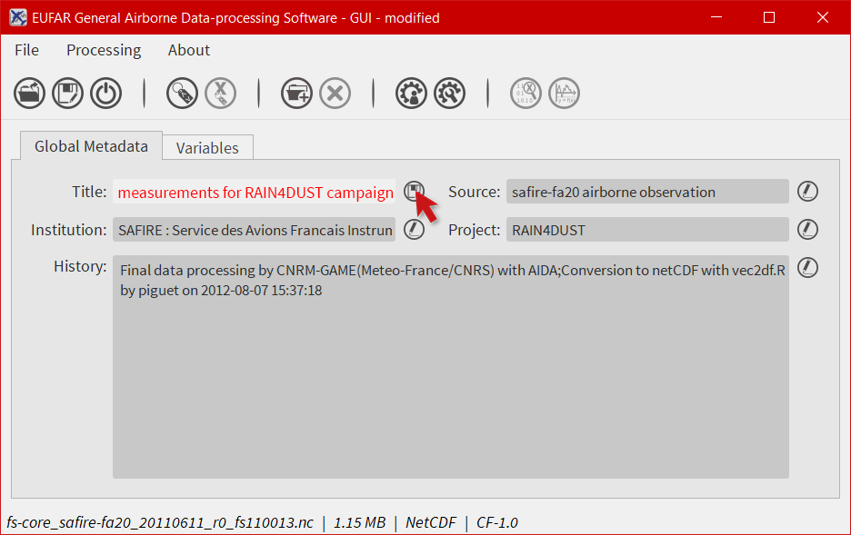

* The software should display the modified attribute and the word ``modified`` in the window title.

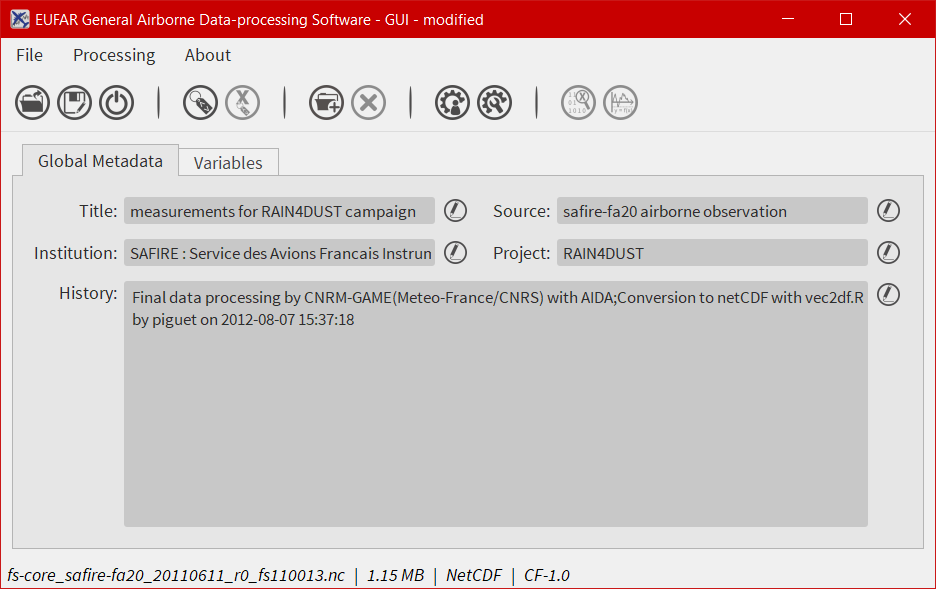

---------------------------------
From the global attributes window
---------------------------------

* Click on |global attributes| to open the global attributes window.

.. image:: images/egads_gui_screencaptures/EGADS_GUI_global_attributes_window_1.png
   :width: 936px
   :height: 647px
   :scale: 45 %
   :align: center

.. |global attributes| image:: images/icons/glo_metadata_icon.png
   :width: 130px
   :height: 130px
   :scale: 12 %

* Here you have the possibility to create, modify and delete global attributes. Click on ``Show other attributes`` to display other attributes not showed in the window. To modify a global attribute, just click in the associated field and enter your text. Then click on ``Save`` to confirm your modification.

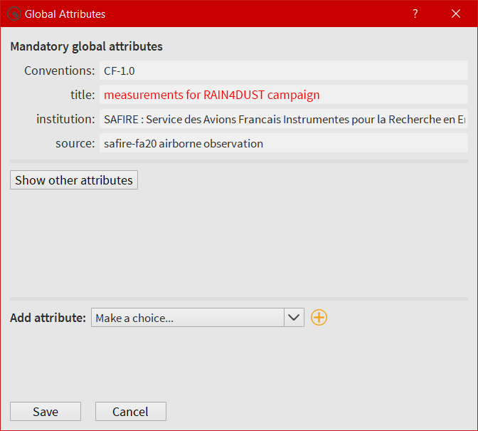

* The software should display the modified attribute and the word ``modified`` in the window title.

********************************************
How to modify the attributes of a variable ?
********************************************

EGADS GUI propose two ways to modify a variable attribute: from the variable attributes tab and from the variable attributes window. The variable attributes tab only shows the most important attributes, in agreement with the EUFAR Standards & Protocols NetCDF convention. The second solution is the only one if the user wants to display other attributes and to create and/or delete variable attributes.

---------------------
From the variable tab
---------------------

* Select the ``Variables`` tab.

.. image:: images/egads_gui_screencaptures/EGADS_GUI_variable_attributes_tab_1.png
   :width: 936px
   :height: 647px
   :scale: 45 %
   :align: center

* Select a variable in the left list and click on |edit| to unlock the associated field of the attribute you want to modify. The |edit| icon is replaced by a |save| icon to confirm that you are in edit mode.

.. image:: images/egads_gui_screencaptures/EGADS_GUI_variable_attributes_tab_2.png
   :width: 936px
   :height: 647px
   :scale: 45 %
   :align: center

* Enter your text and click on |save| to confirm your modification.

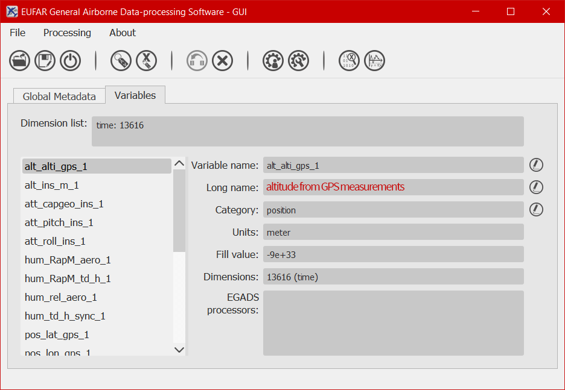

* The software should display the modified attribute and the word ``modified`` in the window title.

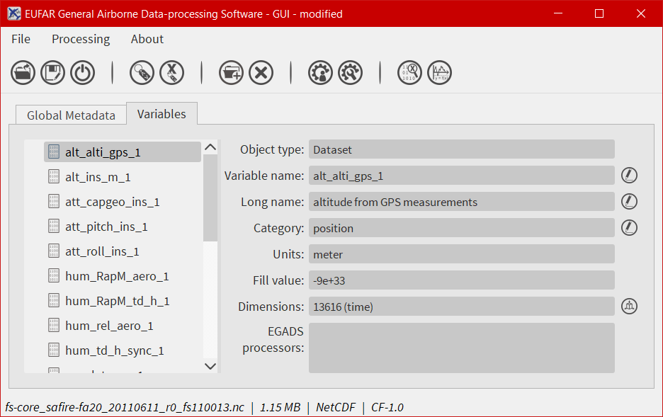

-----------------------------------
From the variable attributes window
-----------------------------------

* Select the ``Variables`` tab.

.. image:: images/egads_gui_screencaptures/EGADS_GUI_variable_attributes_tab_1.png
   :width: 936px
   :height: 647px
   :scale: 45 %
   :align: center

* Select a variable and click on |variable attributes| to open the global attributes window.

.. |variable attributes| image:: images/icons/var_metadata_icon.png
   :width: 130px
   :height: 130px
   :scale: 12 %

.. image:: images/egads_gui_screencaptures/EGADS_GUI_variable_attributes_window_2.png
   :width: 936px
   :height: 647px
   :scale: 45 %
   :align: center

* Here you have the possibility to create, modify and delete variable attributes. Click on ``Show other attributes`` to display other attributes not showed in the window. To modify a variable attribute, just click in the associated field and enter your text. Then click on ``Save`` to confirm your modification.

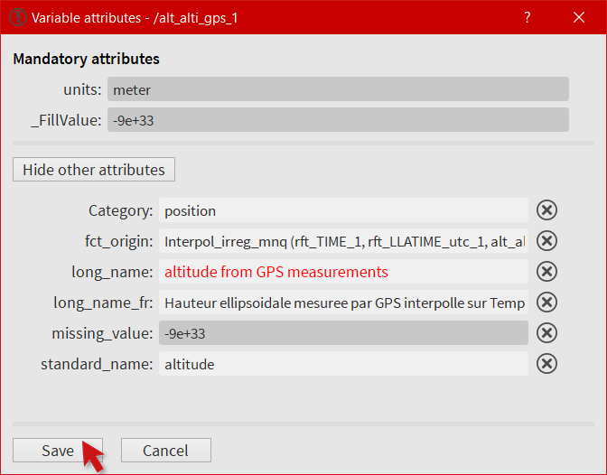

* The software should display the modified attribute and the word ``modified`` in the window title.

**************************
How to process a variable?
**************************

EGADS GUI gives the user the possibility to use and apply algorithm embedded in EGADS. Because of the limitation of the GUI, actually, it is only possible to execute one algorithm at a time. All processings are done through the processing window.

* To launch the processing window, click on |launch process|. The button should be enabled if variables are detected in the GUI.

.. |launch process| image:: images/icons/new_algo_icon.png
   :width: 130px
   :height: 130px
   :scale: 12 %

.. image:: images/egads_gui_screencaptures/EGADS_GUI_processing_window_2.png
   :width: 936px
   :height: 647px
   :scale: 45 %
   :align: center

* The processing window is composed of three tabs: the first one to choose the algorithm, the second one to choose the variable(s) processed by the algorithm, and the last one to set the output(s). First, the user has to choose an algorithm by selecting a ``Category`` and an ``Algorithm``. Information are displayed in the lower part of the tab. Then click on the ``Input(s)`` tab.

.. image:: images/egads_gui_screencaptures/EGADS_GUI_processing_window_3.png
   :width: 702px
   :height: 604px
   :scale: 45 %
   :align: center

* Select the variable(s) to be injected in the algorithm. Info buttons are here for the description of the variables involved in the algorithm. Then click on ``Output(s)``.

.. image:: images/egads_gui_screencaptures/EGADS_GUI_processing_window_4.png
   :width: 702px
   :height: 604px
   :scale: 45 %
   :align: center

* Choose a name for the output(s). The name(s) will be displayed in the main window after the processing.

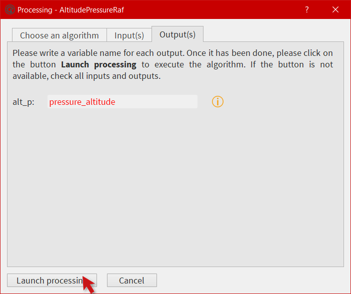

* Depending on the size of the input variables and on the complexity of the algorithm, the processing can take time. Once the output(s) is(are) ready, a new tab appears and new variables are stored here.

.. image:: images/egads_gui_screencaptures/EGADS_GUI_007.png
   :width: 936px
   :height: 647px
   :scale: 45 %
   :align: center

************************************************************************
How to migrate a variable from the new variable tab to the variable tab?
************************************************************************

To avoid wrong manipulation and for the sake of convenience, a tab dedicated to new variables and called ``New variables`` has been introduced in EGADS GUI. Once a variable is created, it will appear in this new tab. If the user wants to save the new variable(s), he must migrate it/them in the ``Variables`` tab.

* To migrate a newly-created variable, select the variable to be migrated in the ``New variables`` tab and click on |migrate|.

.. image:: images/egads_gui_screencaptures/EGADS_GUI_migrate_variable_1.png
   :width: 936px
   :height: 647px
   :scale: 45 %
   :align: center

.. |migrate| image:: images/icons/migrate_icon.png
   :width: 130px
   :height: 130px
   :scale: 12 %

* The newly-created variable should disappear from the ``New variables`` tab (the tab is removed if the list of variable is empty) and appear in the ``Variables`` tab.

.. image:: images/egads_gui_screencaptures/EGADS_GUI_migrate_variable_2.png
   :width: 936px
   :height: 647px
   :scale: 45 %
   :align: center

*************************
How to delete a variable?
*************************

* In the ``Variables`` or ``New variables`` tab, select a variable in the list and click on |delete|.

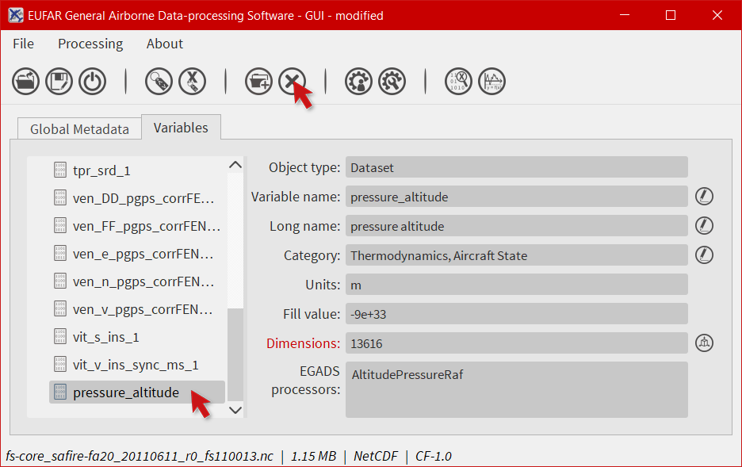

*******************************************
How to create an algorithm through the GUI?
*******************************************

EGADS GUI offers the possibility to create algorithm from a window, by filling in different type of fields. If a complex algorithm has to be written, the most suitable way is to use a text editor like Notepad++ (Windows) or Kate (Linux) and modify the template provided in the EGADS algorithm directory. For more details on how to create algorithms and the purpose of each field, please take a look in the EGADS Lineage Documentation, chapter ALGORITHM DEVELOPMENT.

* To launch the algorithm creation window, just click on |create algorithm|.

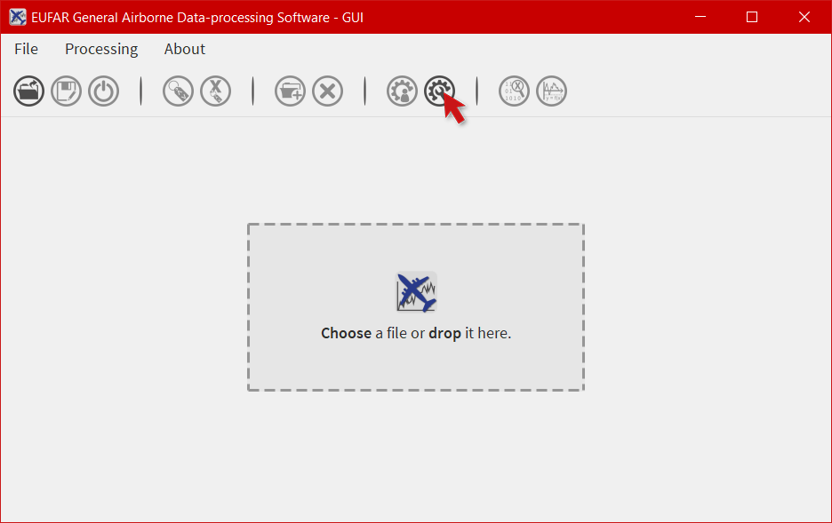

.. |create algorithm| image:: images/icons/create_algo_icon.png
   :width: 130px
   :height: 130px
   :scale: 12 %

* The algorithm creation window is composed of three tabs. The first one to prepare all metadata (category, sources, ...) and the algorithm formula, the second one to create all inputs needed by the algorithm, and the last one to create all outputs returned by the algorithm. First let's prepare all metadata and then the algorithm itself. A special attention should be paid to the ``Algorithm`` field. The formula has to be written in Python 3 (importing modules like numpy is possible). The input variables injected in the algorithm and the output variables returned by the algorithm have to be prepared in the next tabs. Once you are done with the first tab, click on the tab ``Input(s)``.

.. image:: images/egads_gui_screencaptures/EGADS_GUI_create_window_4.png
   :width: 1002px
   :height: 739px
   :scale: 45 %
   :align: center

* To create an input variable, click on the ``+`` button and fill in the different fields. Then click on the tab ``Output(s)``.

.. image:: images/egads_gui_screencaptures/EGADS_GUI_create_window_2.png
   :width: 1002px
   :height: 739px
   :scale: 45 %
   :align: center

* To create an output variable, click on the ``+`` button. The output variable(s) is(are) the result of the algorithm. As EGADS and EGADS GUI are coded in Python, the output variable(s) should be returned by the algorithm: ``return var``. If the ``Units`` of a result has to be the same as one of the input, the user can enter ``input`` and the input number (starting at 0): ``input0`` if the output unit has to be the same than the first input variable. It's the same for the ``Output standard name`` and the ``Output long name``. Once all fields are filled, click on the ``Algorithm`` tab.

.. image:: images/egads_gui_screencaptures/EGADS_GUI_create_window_3.png
   :width: 1002px
   :height: 739px
   :scale: 45 %
   :align: center

.. NOTE::
  It is important to remember that special characters and punctuation, apart from the following list ``. , ; : - _``, can't be used in the different fields. The system won't remove them and it can lead to an exception when the GUI tries to load the algorithm.

.. NOTE::
  There is no system to check the algorithm result. Once the algorithm is saved, EGADS and its GUI expect the algorithm to be true and stable.

.. NOTE::
  If using the stand-alone version of the GUI, new algorithms are saved in the ``user_algorithms`` folder in the main directory. The user always has the possibility to create an algorithm manually with a text editor. In that case, follow the EGADS documentation about new algorithms and save the algorithm in the ``user_algorithms`` folder. Do not forget to edit or create __init__.py files.

**********************************************
How to display information about an algorithm?
**********************************************

When processing data, it is always a good idea to understand how an algorithm works before making use of it. EGADS GUI offers the possibility to display an algorithm in a window.

* To launch the algorithm display window, just click on the ``Processing`` item in the menu bar, then select a category and click on an algorithm.

.. image:: images/egads_gui_screencaptures/EGADS_GUI_display_algorithm_1.png
   :width: 936px
   :height: 647px
   :scale: 45 %
   :align: center

* Information about an algorithm can be found in several tabs.

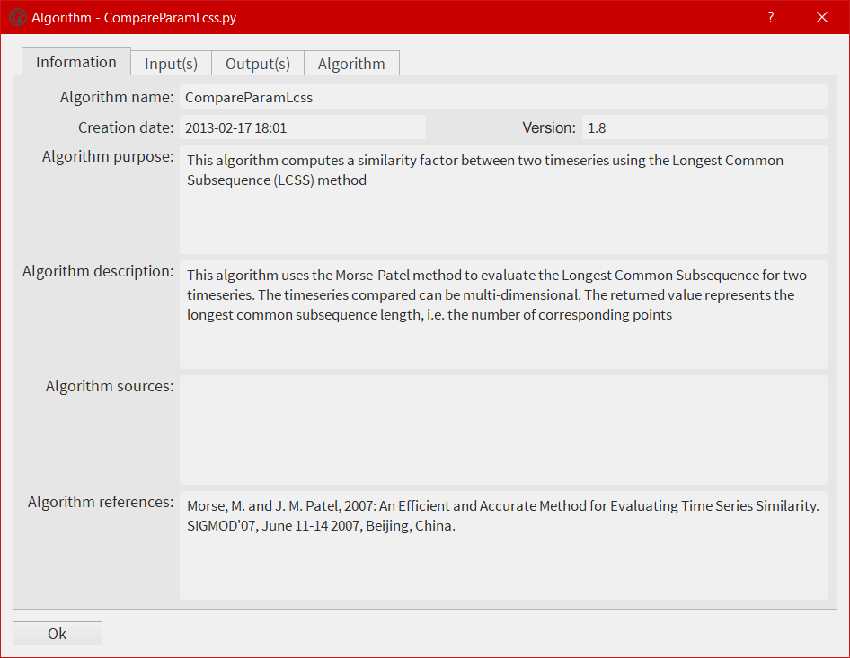

*******************************
How to display variable data?
*******************************

The EGADS GUI offers the possibility to display the values of a variable.

* First select the ``Variables`` tab.

.. image:: images/egads_gui_screencaptures/EGADS_GUI_variable_attributes_tab_1.png
   :width: 936px
   :height: 647px
   :scale: 45 %
   :align: center

* Then select a variable and click on |display data|. You can also right click on a variable to display the variable menu and then click on |display data| Display data.

.. image:: images/egads_gui_screencaptures/EGADS_GUI_display_data_2.png
   :width: 936px
   :height: 647px
   :scale: 45 %
   :align: center

.. |display data| image:: images/icons/data_icon.png
   :width: 130px
   :height: 130px
   :scale: 12 %

* The values are displayed in a table, and few information are given like the units and the name of the variable.

.. image:: images/egads_gui_screencaptures/EGADS_GUI_display_data_3.png
   :width: 652px
   :height: 439px
   :scale: 45 %
   :align: center

************************
How to plot a variable ?
************************

By integrating the Python modules Matplotlib and Cartopy, the EGADS GUI gives the user a great tool to plot data and save the result in a graphic file. Times series and gridded data, georeferenced or not, are handled by the plot window. Actually, there is a limitation with gridded data. Due to an early version of Cartopy, the modification of ticks and labels is only possible for PlateCarree and Mercator projection, until a new version of Cartopy is released.

* To access the plot module, select first the ``Variables`` tab.

.. image:: images/egads_gui_screencaptures/EGADS_GUI_variable_attributes_tab_1.png
   :width: 936px
   :height: 647px
   :scale: 45 %
   :align: center

* Then select a variable (or more) and click on |plot data|. You can also right click on a variable to display the variable menu and then click on |plot data| Plot data.

.. image:: images/egads_gui_screencaptures/EGADS_GUI_plot_data_2.png
   :width: 936px
   :height: 647px
   :scale: 45 %
   :align: center

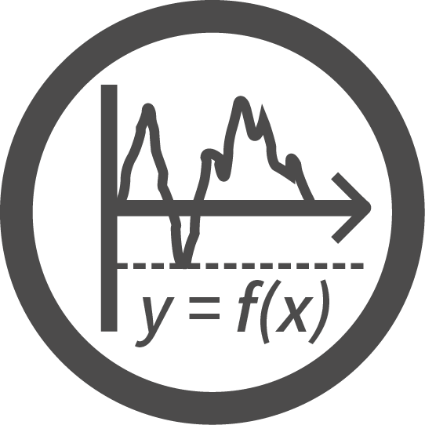

* Time series or gridded data are plot using default options. Figure and plot options are available to modify entirely the plot. There is also a tab for options dedicated to the saving process.

.. image:: images/egads_gui_screencaptures/EGADS_GUI_plot_data_3.png
   :width: 1252px
   :height: 789px
   :scale: 45 %
   :align: center

* An example of what can be achieved with gridded data.

.. image:: images/egads_gui_screencaptures/EGADS_GUI_plot_data_4.png
   :width: 1252px
   :height: 789px
   :scale: 45 %
   :align: center

******************************************
How to export data to an external format ?
******************************************

If the user wants to display data into Google Earth software, there is a possibility to export data to KML/KMZ file format. At this time, only data along a georeferenced path (generally time series) can be exported and displayed. Later, it will be possible to generate map and embed it in a KML/KMZ file for gridded data.

* To launch the export window, click on the ``File`` menu and then on |export icon|. The button should be enabled if a netCdf of NasaAmes file has been opened.

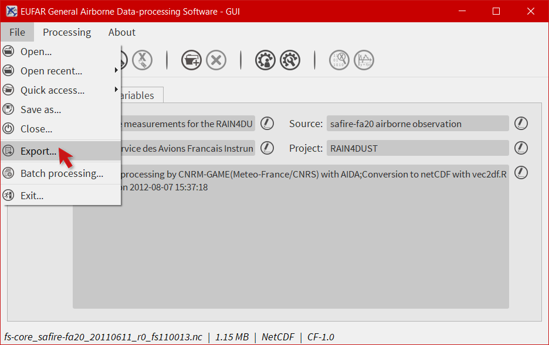

* The export window is composed of a combobox to select the new format, a menu on the left for the different sections linked to the selected format and a central widget displaying the different options. First, select the format ``Google Earth - Time series``.

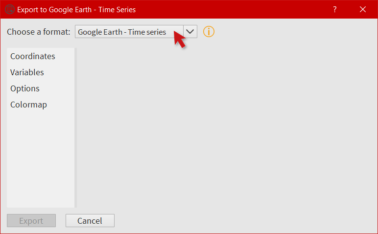

* Click on ``Coordinates``. This part is mandatory, it is used to build the path in Google Earth. Choose a variable for the longitude and latitude, then a variable for the altitude, or select Stick to the ground if altitude is not necessary.

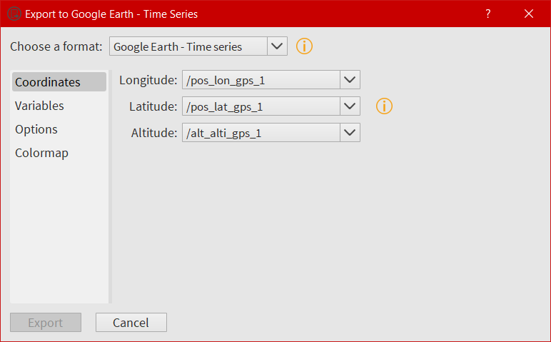
  
* Then click on ``Variables``. Select the variable you want to "display" in Google Earth and click on the arrow button to register if. At this time, only one variable can be registered, but this number should increase once the function is stable.

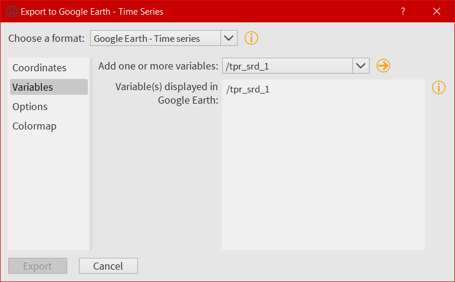

* Click on ``Options``. Here are referenced few options to tweak the look of the path. If the path and the variable to be displayed in Google Earth contain a great number of points, it is possible to reduce the amount of points with the last option.

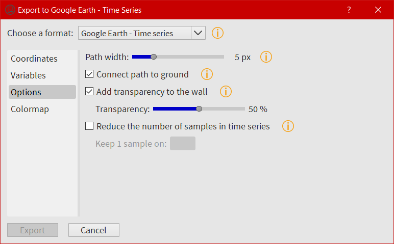

* And finally click on ``Colormap`` to tweak the colormap. Eight colormaps are available at this time and more tweaking options will be available in the future. To save the file, click on ``Export`` once the button has been activated : only ``Coordinates``, ``Variables`` and ``Colormap`` are mandatory to activate it.

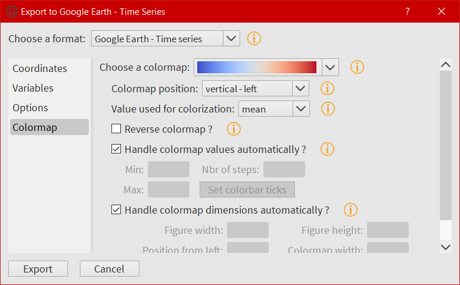

* Here is the result in Google Earth:

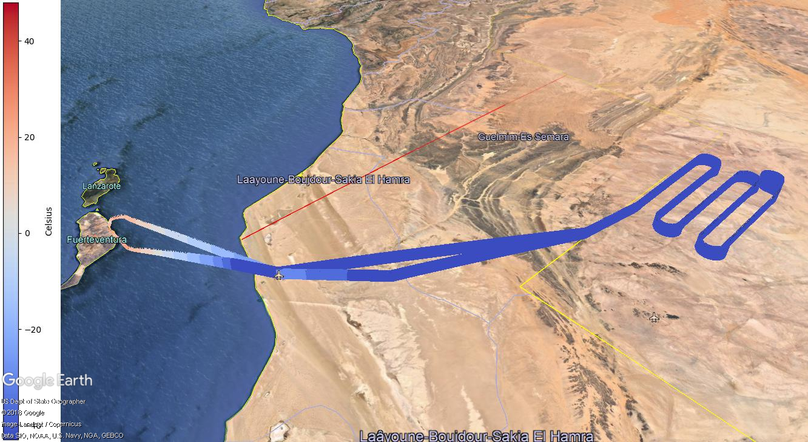

******************************************
How to use the batch processing function ?
******************************************

EGADS GUI gives the user the possibility to use a batch processing function. This way it is possible to use an algorithm, concatenate, delete one or more variables, one or more metadata, or just convert between file formats, with multiple files.

* To launch the batch processing window, click on the ``File`` menu and then on |launch process|. The button should be enabled if variables are detected in the GUI.

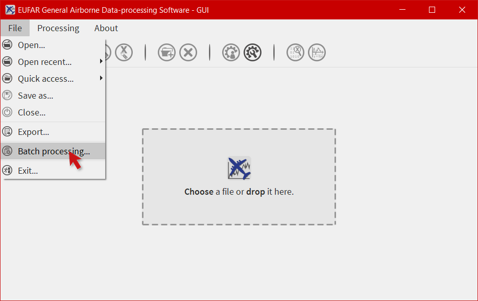

* The processing window is composed of three to four tabs: the first one to choose the processing (concatenation, variable or metadata deletion, conversion between file format, algorithm processing), the second one to choose the files to be processed, the third one, if needed by the processing, can list options, and the last one to set the output folder and the filename oprtions of all new files.

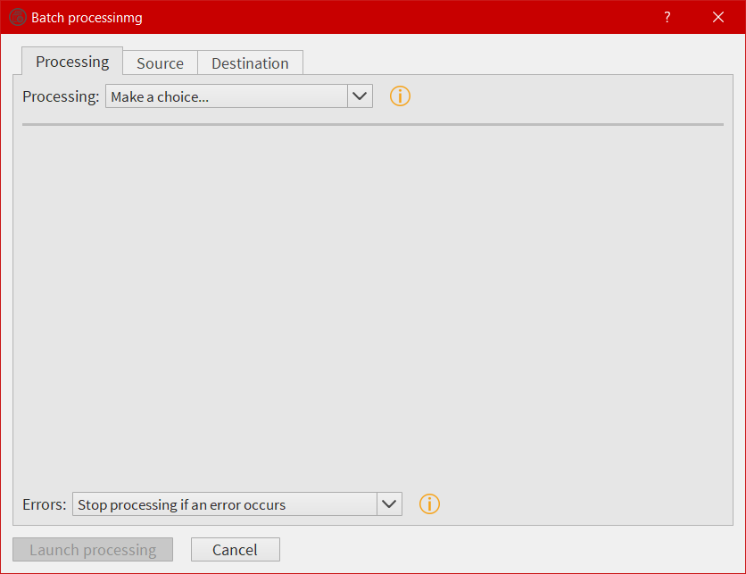

* First, select a processing in the processing combobox, for example Execute an algorithm, then select a Category and an Algorithm in the following comboboxes.

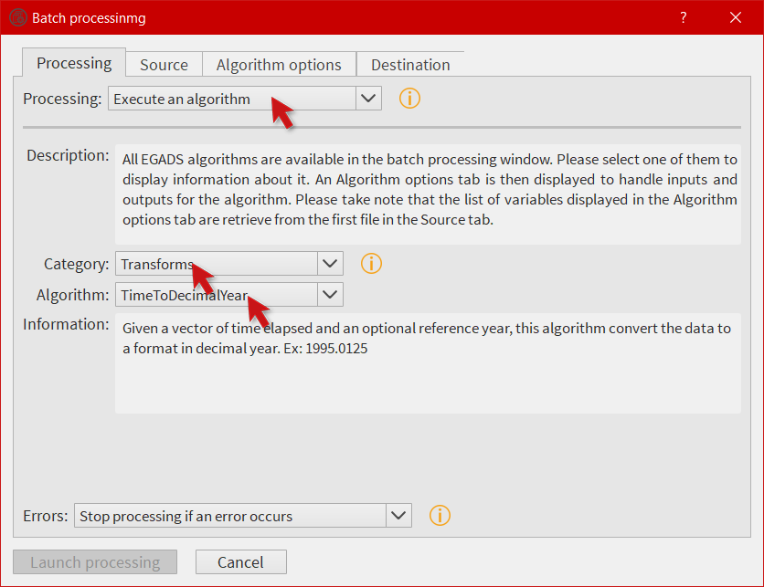

* Select the files to be processed by the algorithm. It will populate automatically the options and a list of variable in the next tab.

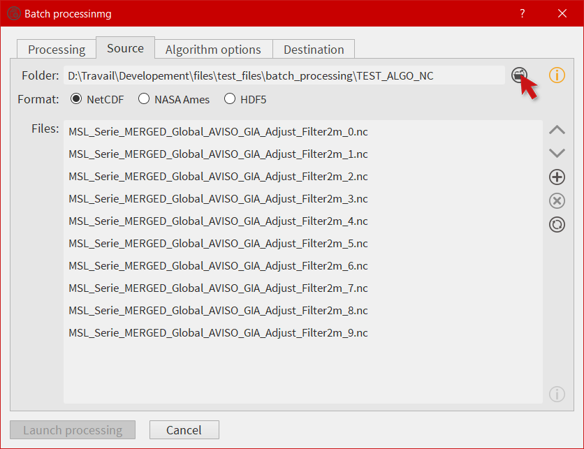

* As in the processing window, select the variables to be injected in the algorithm, and choose a name for the output(s).

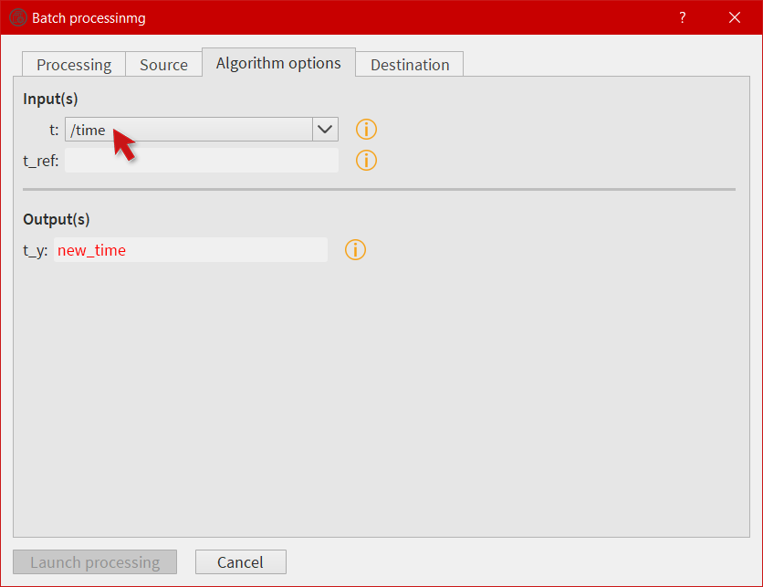

* Finally select an output folder, and set options to define a new filename for all output files. Click on ``Launch processing`` to start the batch processing.

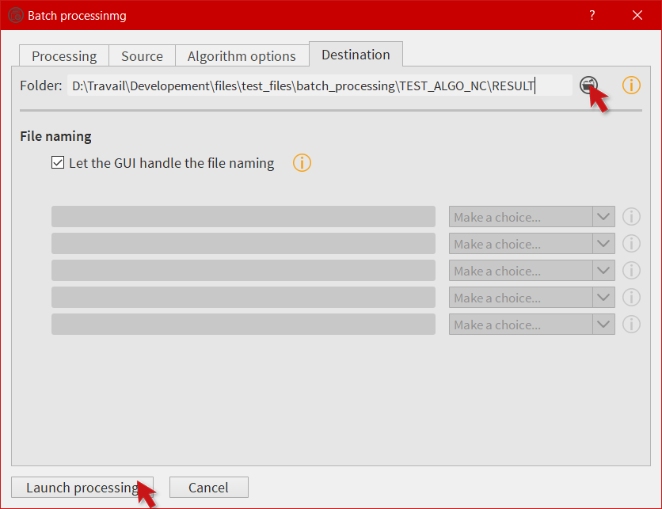
