========
Tutorial
========

*********************
Important information
*********************

All tutorials proposed here are produced using a NetCDF file as a reference. Apart from the fact that metadata are different, there is almost no difference concerning the interface if using a NASA Ames file.
Once the GUI is ready to handle raw, csv and text files, the corresponding tutorials will be added here if certain differences exist compared to NetCDF handling.

*******************
How to open a file?
*******************

* To open a file, a NetCDF file for example, from the EGADS GUI, first click on the icon |open|.

.. image:: images/egads_gui_screencaptures/EGADS_GUI_open_file_1b.png
   :width: 1167px
   :height: 601px
   :scale: 45 %
   :align: left

.. |open| image:: images/icons/open_popup_icon.png
   :width: 130px
   :height: 130px
   :scale: 12 %
   :align: middle

* Then apply the filter ``NetCDF Files (*.nc)``, select the NetCDF file you want to open in the list, and click on ``Open``.

.. image:: images/egads_gui_screencaptures/EGADS_GUI_open_file_2b.png
   :width: 959px
   :height: 607px
   :scale: 45 %
   :align: center

* If the file is loaded as it should, the interface specific to NASA Ames/NetCDF files should be displayed without any warning.

.. image:: images/egads_gui_screencaptures/EGADS_GUI_open_file_3b.png
   :width: 1167px
   :height: 601px
   :scale: 45 %
   :align: center

* Another way to open a file is to use the menu ``File`` and then click on ``Open...``.

*******************
How to save a file?
*******************

* To save a file, the user has two possibilities. The first one by clicking on |save|. Its the basic saving function when a file has been modified.

.. image:: images/egads_gui_screencaptures/EGADS_GUI_save_file_1.png
   :width: 1167px
   :height: 601px
   :scale: 45 %
   :align: center

.. |save| image:: images/icons/save_icon.png
   :width: 130px
   :height: 130px
   :scale: 12 %

* The second one by clicking on |save_as|. It's the usual way to save a file with a new name, or to convert a file from a format to another format.

.. image:: images/egads_gui_screencaptures/EGADS_GUI_save_file_2.png
   :width: 1167px
   :height: 601px
   :scale: 45 %
   :align: center

.. |save_as| image:: images/icons/save_as_icon.png
   :width: 130px
   :height: 130px
   :scale: 12 %

* When ``Saving As`` is selected, just enter the name of the new file and the format, then click ``Save`` to confirm the action.

.. image:: images/egads_gui_screencaptures/EGADS_GUI_save_file_3.png
   :width: 959px
   :height: 607px
   :scale: 45 %
   :align: center

********************
How to close a file?
********************

* Once a file has been opened, it is possible to close it by clicking on |close|.

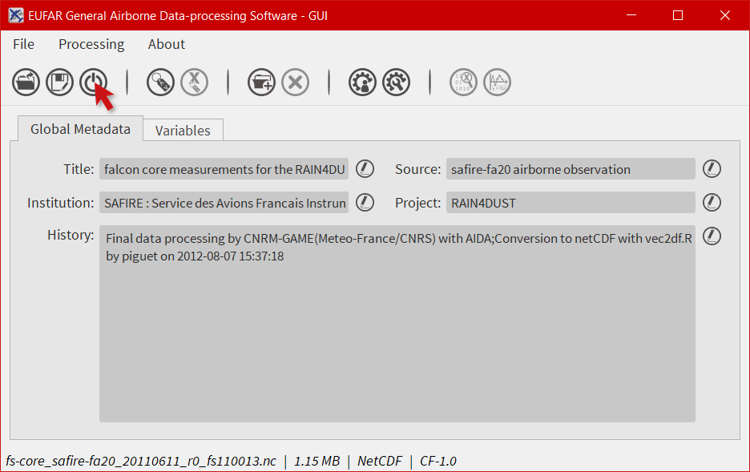

.. |close| image:: images/icons/off_icon.png
   :width: 130px
   :height: 130px
   :scale: 12 %

* As a consequence, the graphical interface should be cleaned.

.. image:: images/egads_gui_screencaptures/EGADS_GUI_000.png
   :width: 1167px
   :height: 598px
   :scale: 45 %
   :align: center

*******************************
How to launch batch processing?
*******************************

The processing of multiple files at once has not been implemented yet.

*****************************************************
How to modify the global attributes of a NetCDF file?
*****************************************************

EGADS GUI proposes two ways to modify a global attribute: from the global attributes tab and from the global attributes window. The global attributes tab only shows the most important attributes, in agreement with the EUFAR Standards & Protocols NetCDF convention. The second solution is the only one if the user wants to display other attributes and to create and/or delete global attributes.

------------------------------
From the global attributes tab
------------------------------

* To unlock a field and edit the associated attribute, click on |edit|. The |edit| icon is replaced by a |save| icon to confirm that you are in edit mode.

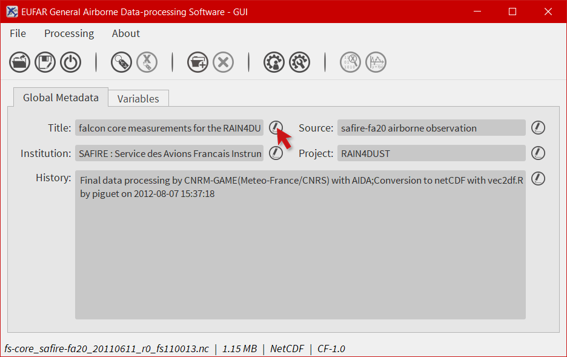

.. |edit| image:: images/icons/edit_icon.png
   :width: 130px
   :height: 130px
   :scale: 12 %

.. |save| image:: images/icons/save_icon.png
   :width: 130px
   :height: 130px
   :scale: 12 %

* Then, modify the attribute as you wish.

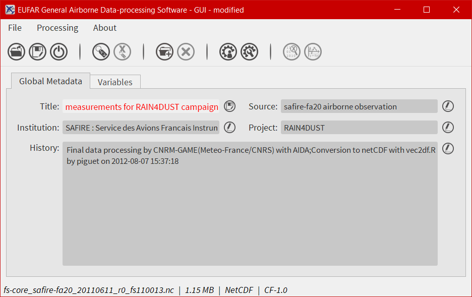

* And click on |save| to confirm the modification.

.. image:: images/egads_gui_screencaptures/EGADS_GUI_global_attributes_tab_2.png
   :width: 1167px
   :height: 601px
   :scale: 45 %
   :align: center

* The software should display the modified attribute and the word ``modified`` in the window title.

.. image:: images/egads_gui_screencaptures/EGADS_GUI_global_attributes_tab_3.png
   :width: 1167px
   :height: 601px
   :scale: 45 %
   :align: center

---------------------------------
From the global attributes window
---------------------------------

* Click on |global attributes| to open the global attributes window.

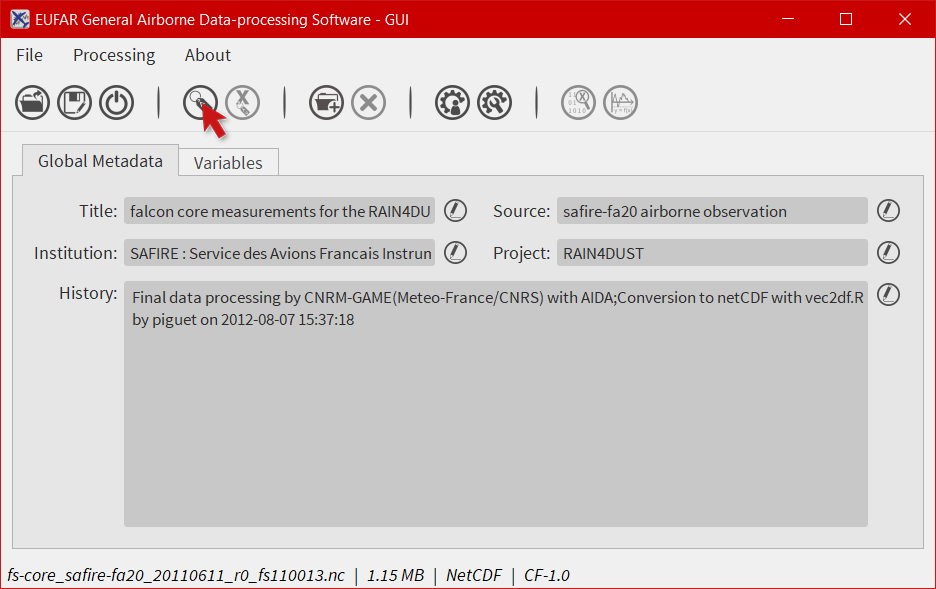

.. |global attributes| image:: images/icons/glo_metadata_icon.png
   :width: 130px
   :height: 130px
   :scale: 12 %

* Here you have the possibility to create, modify and delete global attributes. Click on ``Show other attributes`` to display other attributes not showed in the window. To modify a global attribute, just click in the associated field and enter your text. Then click on ``Save`` to confirm your modification.

.. image:: images/egads_gui_screencaptures/EGADS_GUI_global_attributes_window_2.png
   :width: 717px
   :height: 454px
   :scale: 45 %
   :align: center

* The software should display the modified attribute and the word ``modified`` in the window title.

.. image:: images/egads_gui_screencaptures/EGADS_GUI_global_attributes_window_3.png
   :width: 1167px
   :height: 601px
   :scale: 45 %
   :align: center

********************************************
How to modify the attributes of a variable ?
********************************************

EGADS GUI propose two ways to modify a variable attribute: from the variable attributes tab and from the variable attributes window. The variable attributes tab only shows the most important attributes, in agreement with the EUFAR Standards & Protocols NetCDF convention. The second solution is the only one if the user wants to display other attributes and to create and/or delete variable attributes.

---------------------
From the variable tab
---------------------

* Select the ``Variables`` tab.

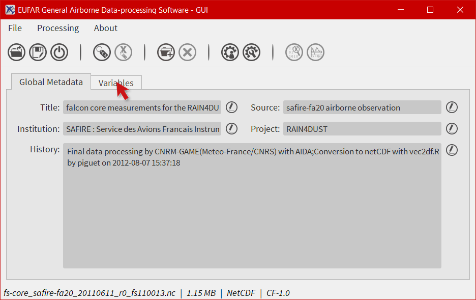

* Select a variable in the left list and click on |edit| to unlock the associated field of the attribute you want to modify. The |edit| icon is replaced by a |save| icon to confirm that you are in edit mode.

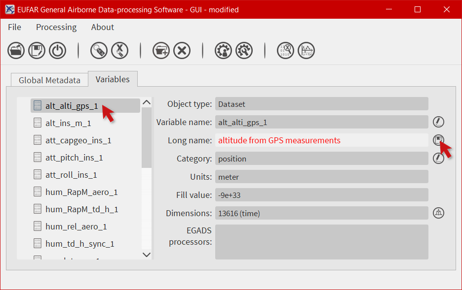

.. |edit| image:: images/icons/edit_icon.png
   :width: 130px
   :height: 130px
   :scale: 12 %

.. |save| image:: images/icons/save_icon.png
   :width: 130px
   :height: 130px
   :scale: 12 %

* Enter your text and click on |save| to confirm your modification.

.. image:: images/egads_gui_screencaptures/EGADS_GUI_variable_attributes_tab_3.png
   :width: 1167px
   :height: 601px
   :scale: 45 %
   :align: center

* The software should display the modified attribute and the word ``modified`` in the window title.

.. image:: images/egads_gui_screencaptures/EGADS_GUI_variable_attributes_tab_4.png
   :width: 1167px
   :height: 601px
   :scale: 45 %
   :align: center

-----------------------------------
From the variable attributes window
-----------------------------------

* Select the ``Variables`` tab.

.. image:: images/egads_gui_screencaptures/EGADS_GUI_variable_attributes_window_1.png
   :width: 1167px
   :height: 601px
   :scale: 45 %
   :align: center

* Select a variable and click on |variable attributes| to open the global attributes window.

.. |variable attributes| image:: images/icons/var_metadata_icon.png
   :width: 130px
   :height: 130px
   :scale: 12 %

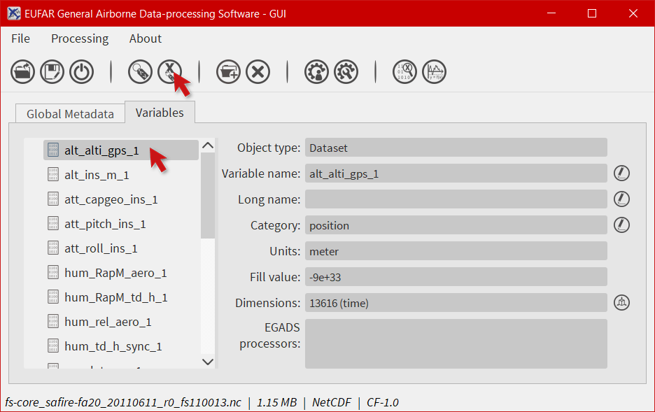

* Here you have the possibility to create, modify and delete variable attributes. Click on ``Show other attributes`` to display other attributes not showed in the window. To modify a variable attribute, just click in the associated field and enter your text. Then click on ``Save`` to confirm your modification.

.. image:: images/egads_gui_screencaptures/EGADS_GUI_variable_attributes_window_3.png
   :width: 717px
   :height: 454px
   :scale: 45 %
   :align: center

* The software should display the modified attribute and the word ``modified`` in the window title.

.. image:: images/egads_gui_screencaptures/EGADS_GUI_variable_attributes_window_4.png
   :width: 1167px
   :height: 601px
   :scale: 45 %
   :align: center

*********************************
How to create a simple variable ?
*********************************

This function has not been implemented yet.

**************************
How to process a variable?
**************************

EGADS GUI gives the user the possibility to use and apply algorithm embedded in EGADS. Because of the limitation of the GUI, actually, it is only possible to execute one algorithm at a time. All processings are done through the processing window.

* To launch the processing window, select the ``Variables`` tab.

.. image:: images/egads_gui_screencaptures/EGADS_GUI_processing_window_1.png
   :width: 1167px
   :height: 601px
   :scale: 45 %
   :align: center

* And click on |launch process|

.. |launch process| image:: images/icons/new_algo_icon.png
   :width: 130px
   :height: 130px
   :scale: 12 %

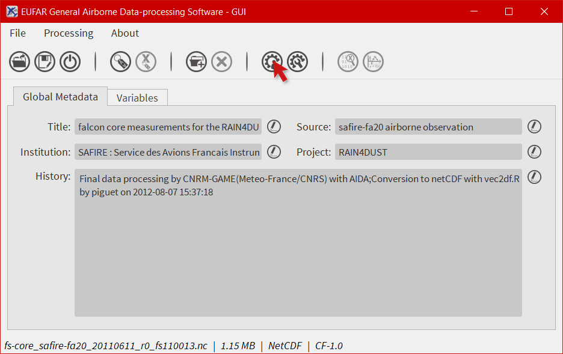

* The processing window is composed of three tabs: the first one to choose the algorithm, the second one to choose the variable(s) processed by the algorithm, and the last one to set the output(s). First, the user has to choose an algorithm by selecting a ``Category`` and an ``Algorithm``. Information are displayed in the lower part of the tab. Then click on the ``Input(s)`` tab.

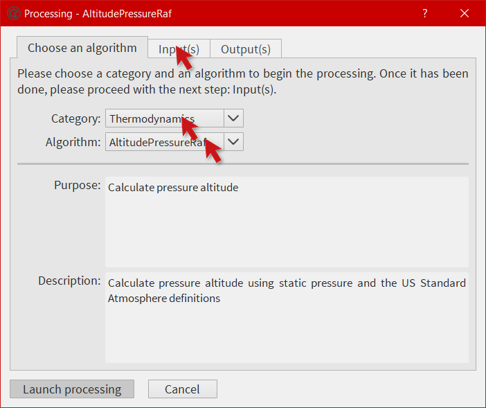

* Select the variable(s) to be injected in the algorithm. Info buttons are here for the description of the variables involved in the algorithm. Then click on ``Output(s)``.

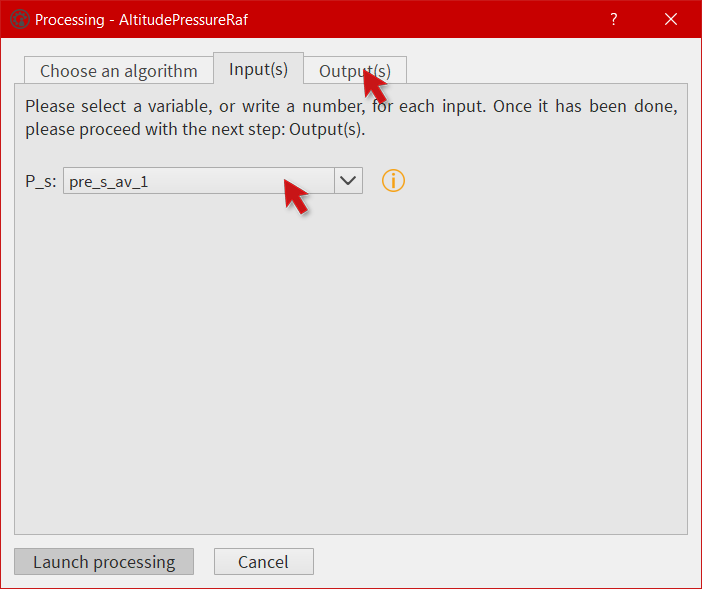

* Choose a name for the output(s). The name(s) will be displayed in the main window after the processing.

.. image:: images/egads_gui_screencaptures/EGADS_GUI_processing_window_5.png
   :width: 717px
   :height: 619px
   :scale: 45 %
   :align: center

* Depending on the size of the input variables and on the complexity of the algorithm, the processing can take time. Once the output(s) is(are) ready, a new tab appears and new variables are stored here.

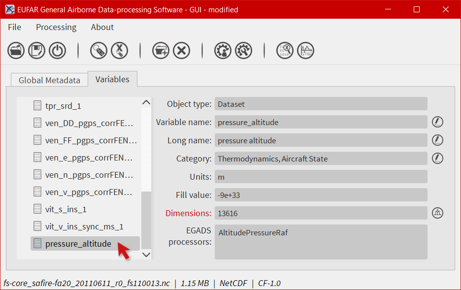

************************************************************************
How to migrate a variable from the new variable tab to the variable tab?
************************************************************************

To avoid wrong manipulation and for the sake of convenience, a tab dedicated to new variables and called ``New variables`` has been introduced in EGADS GUI. Once a variable is created, it will appear in this new tab. If the user wants to save the new variable(s), he must migrate it/them in the ``Variables`` tab.

* To migrate a newly-created variable, select the variable to be migrated in the ``New variables`` tab and click on |migrate|.

.. image:: images/egads_gui_screencaptures/EGADS_GUI_migrate_variable_1.png
   :width: 1167px
   :height: 601px
   :scale: 45 %
   :align: center

* The newly-created variable should disappear from the ``New variables`` tab (the tab is removed if the list of variable is empty) and appear in the ``Variables`` tab.

.. image:: images/egads_gui_screencaptures/EGADS_GUI_migrate_variable_2.png
   :width: 1167px
   :height: 601px
   :scale: 45 %
   :align: center

*************************
How to delete a variable?
*************************

* In the ``Variables`` or ``New variables`` tab, select a variable in the list and click on |delete|.

.. image:: images/egads_gui_screencaptures/EGADS_GUI_delete_variable_1.png
   :width: 1167px
   :height: 601px
   :scale: 45 %
   :align: center

.. |delete| image:: images/icons/del_icon.png
   :width: 130px
   :height: 130px
   :scale: 12 %

* For NetCDF file, a warning information is displayed if a variable is deleted for the first time.

.. image:: images/egads_gui_screencaptures/EGADS_GUI_delete_variable_2.png
   :width: 467px
   :height: 311px
   :scale: 45 %
   :align: center

* Once a variable is deleted, the user have to save the file, with a different name if it is a NetCDF one, to delete the variable in the file.

.. image:: images/egads_gui_screencaptures/EGADS_GUI_delete_variable_3.png
   :width: 1167px
   :height: 601px
   :scale: 45 %
   :align: center

*******************************************
How to create an algorithm through the GUI?
*******************************************

EGADS GUI offers the possibility to create algorithm from a window, by filling in different kind of fields. If a complex algorithm has to be written, the most suitable way is to use a text editor as Notepad++ (Windows) or Kate (Linux) and modify the template provided in the EGADS algorithm directory.

* To launch the algorithm creation window, just click on |create algorithm|.

.. image:: images/egads_gui_screencaptures/EGADS_GUI_create_window_1.png
   :width: 1167px
   :height: 601px
   :scale: 45 %
   :align: center

.. |create algorithm| image:: images/icons/create_algo_icon.png
   :width: 130px
   :height: 130px
   :scale: 12 %

* The algorithm creation window is composed of three tabs. The first one to create all inputs needed by the algorithm, the second one to create all outputs created by the algorithm, and the last one to prepare all metadata (category, sources, ...) and the algorithm formula. First let's create an input variable. Click on the ``+`` button and fill in the different fields. Then click on the tab ``Output(s)``.

.. image:: images/egads_gui_screencaptures/EGADS_GUI_create_window_2.png
   :width: 1017px
   :height: 754px
   :scale: 45 %
   :align: center

* To create an output variable, click on the ``+`` button. The output variable(s) is(are) the result of the algorithm. As EGADS and EGADS GUI are coded in Python, the output variable(s) should be returned by the algorithm: ``return var``. If the ``Units`` of a result has to be the same as one of the input, the user can enter ``input`` and the input number (starting at 0): ``input0`` if the output unit has to be the same than the first input variable. It's the same for the ``Output standard name`` and the ``Output long name``. Once all fields are filled, click on the ``Algorithm`` tab.

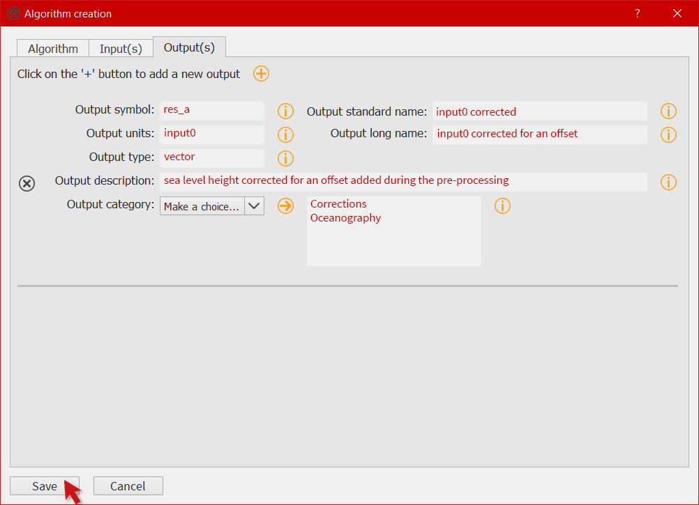

* The algorithm tab has 2 purposes: metadata and algorithm formula. A special attention should be paid to the ``Algorithm`` field. The formula has to be written in Python 2.7 (importing modules like numpy is possible), involving the inputs and outputs created earlier, and the algorithm should always return the outputs. Once the algorithm is ready, click on ``Save`` to save it in the EGADS user algorithm directory. If there is a problem with one of the units, a warning message will be displayed.

.. image:: images/egads_gui_screencaptures/EGADS_GUI_create_window_4.png
   :width: 1017px
   :height: 754px
   :scale: 45 %
   :align: center

.. NOTE::
  There is no system to check the algorithm result. Once the algorithm is saved, EGADS and its GUI expect the algorithm to be true and stable.

**********************************************
How to display information about an algorithm?
**********************************************

When processing data, it is always a good idea to understand how an algorithm works before making use of it. EGADS GUI offers the possibility to display an algorithm in a window.

* To launch the algorithm display window, just click on the ``Processing`` item in the menu bar, then select a category and click on an algorithm.

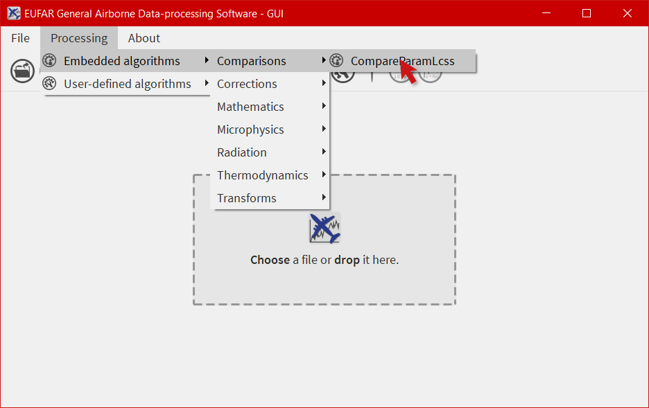

* Information about an algorithm can be found in several tabs.

.. image:: images/egads_gui_screencaptures/EGADS_GUI_display_algorithm_2.png
   :width: 717px
   :height: 619px
   :scale: 45 %
   :align: center

*******************************
How to display a variable data?
*******************************

The EGADS GUI offers the possibility to display the values of a variable. At that time, it is not possible to modify them.

* First select the ``Variables`` tab.

.. image:: images/egads_gui_screencaptures/EGADS_GUI_display_data_1.png
   :width: 1167px
   :height: 601px
   :scale: 45 %
   :align: center

* Then select a variable and click on |display data|.

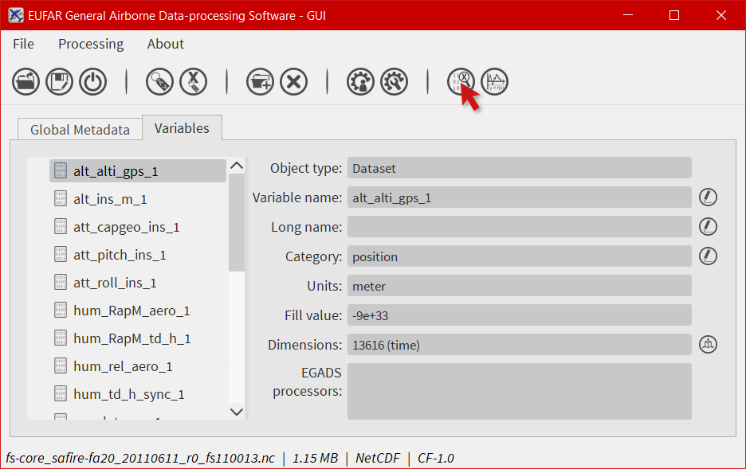

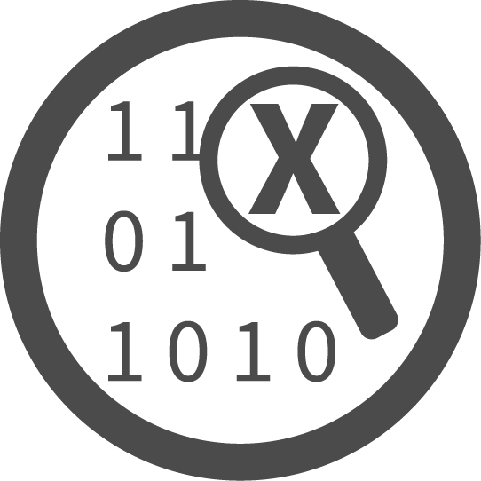

* The values are displayed in a table, and few information are given like the units and the name of the variable.

.. image:: images/egads_gui_screencaptures/EGADS_GUI_display_data_3.png
   :width: 1064px
   :height: 374px
   :scale: 45 %
   :align: center

************************
How to plot a variable ?
************************

By integrating the Python module Matplotlib, the EGADS GUI gives the user a great tool to plot data and save the result in a graphic file. Actually only time series can be plotted. Gridded data should be integrated quickly.

* To access the plot module, select first the ``Variables`` tab.

.. image:: images/egads_gui_screencaptures/EGADS_GUI_plot_data_1.png
   :width: 1167px
   :height: 601px
   :scale: 45 %
   :align: center

* Then click on |plot data|. For the first launch, it can take a long time to display the window, as the Matplotlib module has to create the system font database.

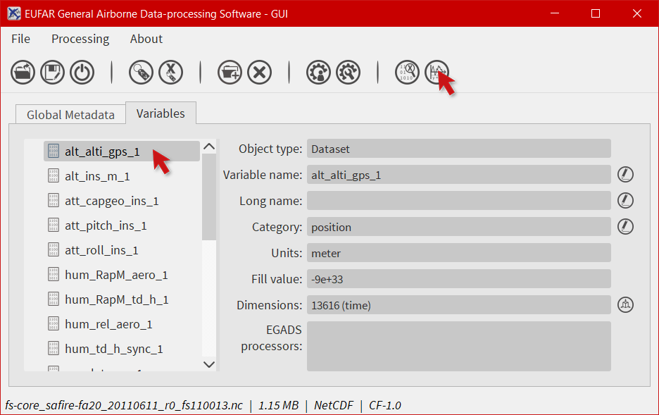

.. |plot data| image:: images/icons/plot_icon.png
   :width: 130px
   :height: 130px
   :scale: 12 %

* With the plot function, the user can plot a single figure or multiple figures on the same graph.

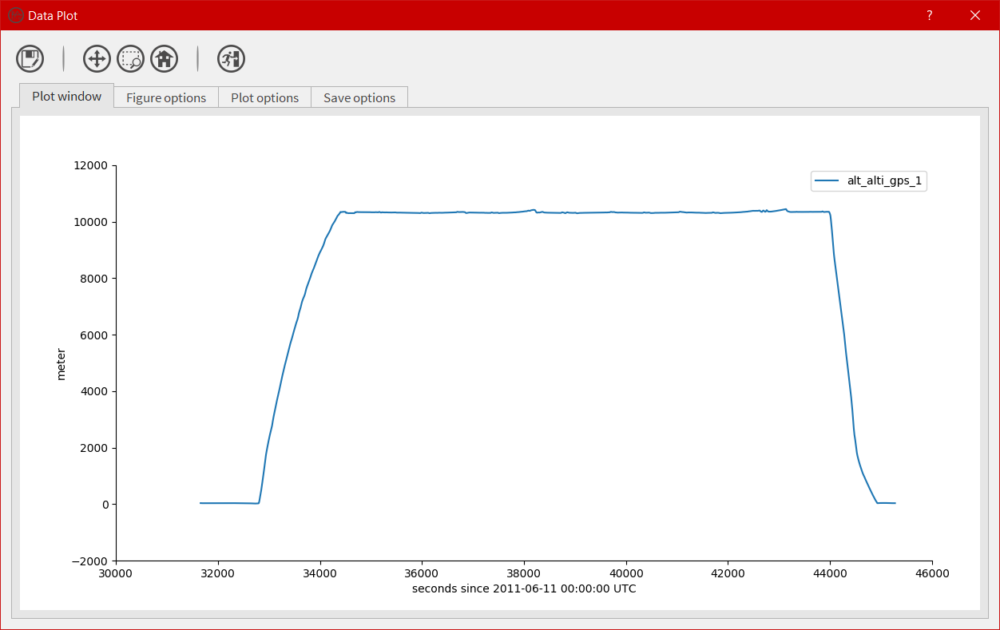

* For our tutorial, let's select ``Single plot``. Two comboboxes appear. In the first one, select the variable for the X axis, for example the time. In the second one, select a variable for the Y axis. Once it is done, click on the ``+`` button to add the variable of the Y axis to the list of plotted variables. The figure is drawn automatically with default options. By choosing another variable in the Y axis list and clicking on the ``+`` button, you can plot multiple variables on the same figure. Then let's modify the options of the figure, click on ``Figure options``

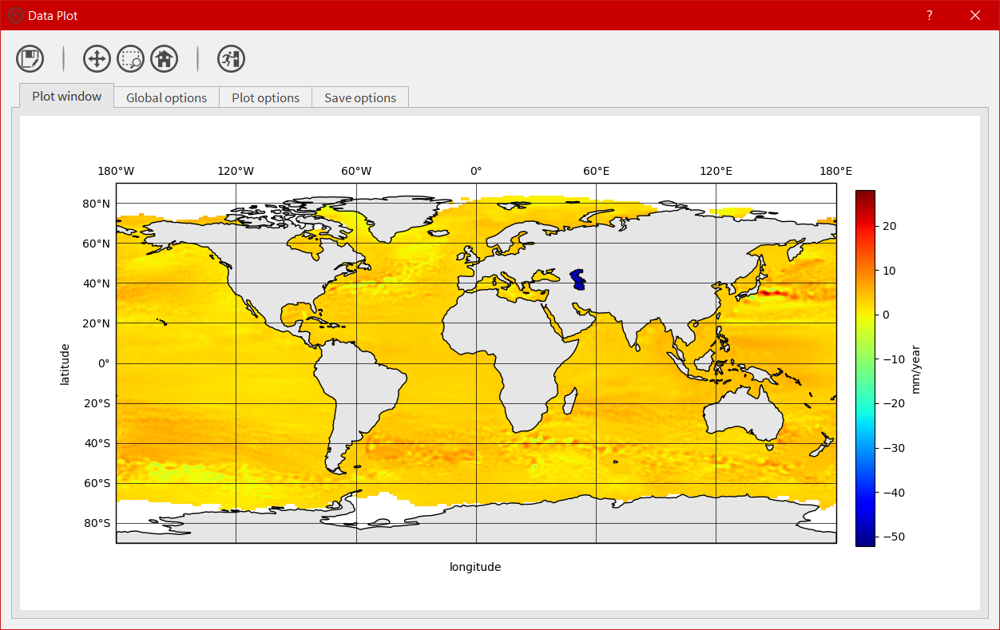

* Those options appear only if a figure has been drawn. For multiple figures on the same graph, multiple option sets will appear. Change few option here and click on ``Update`` to apply the new options to the figure. Then click on ``Plot options`` to change the options dedicated to the variable drawn in the figure.

.. image:: images/egads_gui_screencaptures/EGADS_GUI_plot_data_5.png
   :width: 1122px
   :height: 713px
   :scale: 45 %
   :align: center

* Each time a variable is drawn, a new set of plot options will be displayed. It is possible here to change the options directly related to the variable curve, like the colour or the legend. As before, you have to click on ``Update`` to apply those modifications. And let's have a look to the result by clicking on ``Plot window``

.. image:: images/egads_gui_screencaptures/EGADS_GUI_plot_data_6.png
   :width: 1122px
   :height: 713px
   :scale: 45 %
   :align: center

* If the result is satisfying, click on ``Save options`` to modify the save settings of the figure.

.. image:: images/egads_gui_screencaptures/EGADS_GUI_plot_data_7.png
   :width: 1122px
   :height: 713px
   :scale: 45 %
   :align: center

* Change the settings at your heart content and click on |save_as|.

.. image:: images/egads_gui_screencaptures/EGADS_GUI_plot_data_8.png
   :width: 1122px
   :height: 713px
   :scale: 45 %
   :align: center

.. |save_as| image:: images/icons/save_as_icon.png
   :width: 130px
   :height: 130px
   :scale: 12 %

* Finally choose a name for the file and click on ``Save``.

.. image:: images/egads_gui_screencaptures/EGADS_GUI_plot_data_9.png
   :width: 959px
   :height: 607px
   :scale: 45 %
   :align: center
